# Lin41 Analysis
Micah Gearhart  
1/6/2017  


```r
library("biomaRt")
library("GenomicFeatures")
library("Rsamtools")

library("GenomicFeatures")
library("Rsamtools")
library("GenomicAlignments")
library("BiocParallel")
library("DESeq2")
library("genefilter")
library("pheatmap")
library("SRAdb")
library("goseq")


library("ggplot2")
library("dplyr")
library("tidyr")
library("magrittr")
library("RColorBrewer")
library("gridExtra")
library("motifStack")
library("VennDiagram")

(ts<-format(Sys.time(), "%a_%b_%d_%Y_%H%M"))
cbPalette <- c("#999999", "#E69F00", "#56B4E9", "#009E73", "#F0E442", "#0072B2", "#D55E00", "#CC79A7")

cbPalette2<-c("#cbc9e2","#9e9ac8","#6a51a3", "#fdbe85","#fd8d3c","#d94701",
          "#56B4E9", "#009E73","#F0E442", "#0072B2", "black","red","green")

wls<- function(x) { paste0(seqnames(x),":",start(x),"-",end(x))}
```

## Download Annotation files for Ensembl 87

```r
ensembl_87 = useMart(biomart="ENSEMBL_MART_ENSEMBL", host="useast.ensembl.org", path="/biomart/martservice",dataset="celegans_gene_ensembl")
txdb<-makeTxDbFromBiomart(biomart="ENSEMBL_MART_ENSEMBL",host="useast.ensembl.org",dataset="celegans_gene_ensembl")

#tx87<-transcriptsBy(txdb, "gene")
ens87<-exonsBy(txdb,by="gene")

#annotations
anno87<-getBM(filters="ensembl_gene_id",values=names(ens87), attributes=c("ensembl_gene_id","wikigene_name","transcript_biotype","external_gene_name"), mart=ensembl_87)

save(ens87,anno87,file="ens87.rdata")
```


## Count 2x for Ensembl 87

```r
load("ens87.rdata")
mapq_filter <- function(features, reads, ignore.strand = FALSE, inter.feature=TRUE)
{
    require(GenomicAlignments) # needed for parallel evaluation
    Union(features, reads[mcols(reads)$mapq >= 4],
          ignore.strand, inter.feature)
}

param <- ScanBamParam(what="mapq")

#select single end bam files that are not filtered by samtools (q4)
(fls <- list.files(".", pattern=glob2rx("*.bam"),full=TRUE))
(fls<-fls[!grepl("q4",fls)])
(fls<-fls[!grepl("PE",fls)])
(fls<-fls[!grepl("IP4_4_23_10.bam",fls)])
bamlst <- BamFileList(fls)

#summarizeOverlaps with multimappers
genehits87<-summarizeOverlaps(ens87,bamlst,mode="Union",singleEnd=TRUE,ignore.strand=TRUE)
apply(assays(genehits87)$counts,2,sum)

#with multimapping Filter
genehits87_mapq_filter<-summarizeOverlaps(ens87,bamlst,mode="mapq_filter", param=param,
                                 singleEnd=TRUE,ignore.strand=TRUE)
apply(assays(genehits87_mapq_filter)$counts,2,sum)

#just check to make sure this is the same as samtools filtering
#(fls <- list.files(".", pattern=glob2rx("*_q4.bam"),full=TRUE))
#bamlst <- BamFileList(fls)
#genehits82q4<-summarizeOverlaps(ens82,bamlst,mode="Union",singleEnd=TRUE,ignore.strand=TRUE)
#apply(assays(genehits82q4)$counts,2,sum)
#all.equal(unname(apply(assays(genehits82_mapq_filter)$counts,2,sum)),unname(apply(assays(genehits82q4)$counts,2,sum)))

save(genehits87,genehits87_mapq_filter,file=paste0("genehits87_",ts,".rdata"))
```

## Compare the biotype Distributions across samples with and without a MAPQ filter

```r
load("ens87.rdata")
load("genehits87_Mon_Feb_06_2017_1446.rdata")

counts87<-as.data.frame(assays(genehits87)$counts)
counts87q4<-as.data.frame(assays(genehits87_mapq_filter)$counts)
                          
summary(idx<-match(rownames(counts87),anno87$ensembl_gene_id))
```

```
##    Min. 1st Qu.  Median    Mean 3rd Qu.    Max. 
##       1   12230   24210   24070   35920   47730
```

```r
counts87$biotype<-anno87[idx,"transcript_biotype"]
counts87q4$biotype<-anno87[idx,"transcript_biotype"]

g1<-tidyr::gather(counts87,sample,counts,-biotype) %>%
  dplyr::group_by(sample,biotype) %>%
  dplyr::summarize(countSum=sum(counts)) %>%
  ggplot(aes(x=sample,y=countSum,fill=biotype)) + ggtitle("Counts with Ensembl87") +
  scale_fill_manual(values=rev(cbPalette2),guide = guide_legend(reverse=TRUE)) +
  geom_bar(stat="identity") + theme_classic() + theme(axis.text.x = element_text(angle = 90,  hjust = 0)) 

g2<-tidyr::gather(counts87q4,sample,counts,-biotype) %>%
  dplyr::group_by(sample,biotype) %>%
  dplyr::summarize(countSum=sum(counts)) %>%
  ggplot(aes(x=sample,y=countSum,fill=biotype)) + ggtitle("Counts with Ensembl87 with Mapping Quality Filter") +
  scale_fill_manual(values=rev(cbPalette2),guide = guide_legend(reverse=TRUE)) +
  geom_bar(stat="identity") + theme_classic() + theme(axis.text.x = element_text(angle = 90,  hjust = 0)) 

grid.arrange(g1,g2,ncol=1)
```

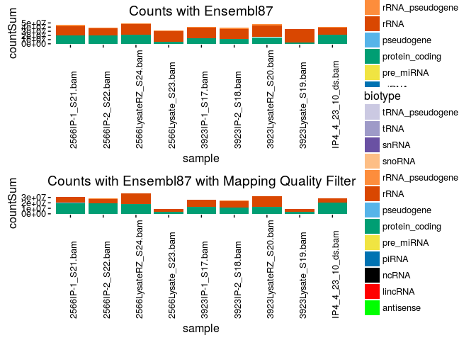<!-- -->


## Filter out rRNA genes and analyze for Enrichment relative to Input

```r
summary(idx<-match(rownames(genehits87),anno87$ensembl_gene_id))
```

```
##    Min. 1st Qu.  Median    Mean 3rd Qu.    Max. 
##       1   12230   24210   24070   35920   47730
```

```r
dim(dds87<-DESeqDataSet(genehits87[anno87[idx,]$transcript_biotype != "rRNA",],design=~1))
```

```
## [1] 46717     9
```

```r
dim(dds87q4<-DESeqDataSet(genehits87_mapq_filter[anno87[idx,]$transcript_biotype != "rRNA",],design=~1))
```

```
## [1] 46717     9
```

```r
file_names<-colnames(dds87)
colnames(dds87)<-sapply(strsplit(colnames(dds87),"_"),function(x) x[1]) %>%
  gsub("2566","OMA-1_",.) %>% gsub("3923","LIN-41_",.) %>% gsub("IP4","OMA-1_042310",.)

colnames(dds87q4)<-sapply(strsplit(colnames(dds87q4),"_"),function(x) x[1]) %>%
  gsub("2566","OMA-1_",.) %>% gsub("3923","LIN-41_",.) %>% gsub("IP4","OMA-1_042310",.)

dds87$tag<-as.factor(c("OMA-1","OMA-1","LysRZ","Lys","LIN-41","LIN-41","LysRZ","Lys","OMA-1_042310"))
dds87q4$tag<-as.factor(c("OMA-1","OMA-1","LysRZ","Lys","LIN-41","LIN-41","LysRZ","Lys","OMA-1_042310"))

design(dds87)<-(~tag)
design(dds87q4)<-(~tag)

plotPCA( DESeqTransform( dds87 ),intgroup="tag")+ ggtitle("PCA without MapQ Filter") + theme_bw()
```

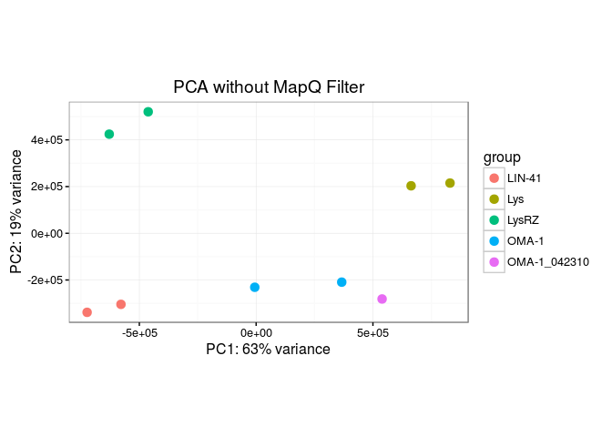<!-- -->

```r
plotPCA( DESeqTransform( dds87q4 ),intgroup="tag")+ ggtitle("PCA with MapQ Filter") + theme_bw()
```

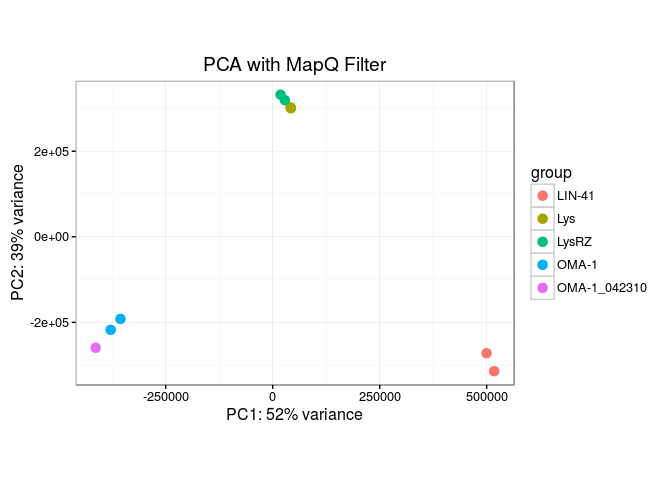<!-- -->

## Run Differential Expression on both dds objects

```r
dds87<-DESeq(dds87)
```

```
## estimating size factors
```

```
## estimating dispersions
```

```
## gene-wise dispersion estimates
```

```
## mean-dispersion relationship
```

```
## final dispersion estimates
```

```
## fitting model and testing
```

```r
plotMA(dds87,ylim=c(-8,8))
```

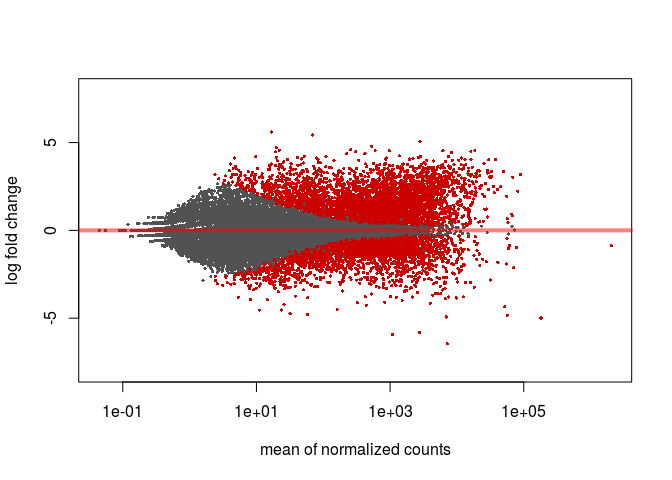<!-- -->

```r
resultsNames(dds87)
```

```
## [1] "Intercept"       "tagLIN.41"       "tagLys"          "tagLysRZ"       
## [5] "tagOMA.1"        "tagOMA.1_042310"
```

```r
res_Oma1_dds87<-results(dds87,lfcThreshold=2,contrast=c("tag","OMA-1","LysRZ"))
res_Lin41_dds87<-results(dds87,lfcThreshold=2,contrast=c("tag","LIN-41","LysRZ"))

#Estimate LogFC for single replicate Oma-1 sample
dds87_counts<-counts(dds87,normalized=TRUE)
res_oma1_042310_dds87<-log2(dds87_counts[,9]+1)-0.5*log2(dds87_counts[,3]+1)-0.5*log2(dds87_counts[,7]+1)

res_dds87<-cbind(res_oma1_042310_dds87,res_Oma1_dds87$log2FoldChange,res_Lin41_dds87$log2FoldChange)
colnames(res_dds87)<-c("Oma-1 042310","Oma-1 IP","Lin-41 IP")

dds87q4<-DESeq(dds87q4)
```

```
## estimating size factors
```

```
## estimating dispersions
```

```
## gene-wise dispersion estimates
```

```
## mean-dispersion relationship
```

```
## final dispersion estimates
```

```
## fitting model and testing
```

```r
plotMA(dds87q4,ylim=c(-8,8))
```

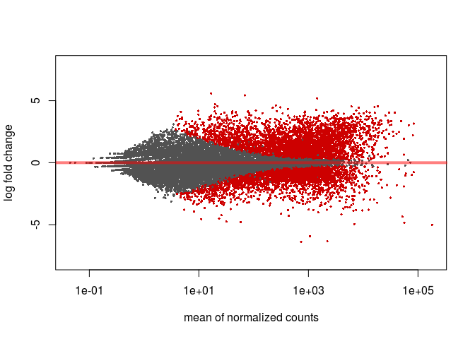<!-- -->

```r
resultsNames(dds87q4)
```

```
## [1] "Intercept"       "tagLIN.41"       "tagLys"          "tagLysRZ"       
## [5] "tagOMA.1"        "tagOMA.1_042310"
```

```r
res_Oma1_dds87q4<-results(dds87q4,lfcThreshold=2,contrast=c("tag","OMA-1","LysRZ"))
res_Lin41_dds87q4<-results(dds87q4,lfcThreshold=2,contrast=c("tag","LIN-41","LysRZ"))

#Estimate LogFC for single replicate Oma-1 sample
dds87q4_counts<-counts(dds87q4,normalized=TRUE)
res_oma1_042310_dds87q4<-log2(dds87q4_counts[,9]+1)-0.5*log2(dds87q4_counts[,3]+1)-0.5*log2(dds87q4_counts[,7]+1)

res_dds87q4<-as.data.frame(cbind(res_oma1_042310_dds87q4,res_Oma1_dds87q4$log2FoldChange,res_Lin41_dds87q4$log2FoldChange))
colnames(res_dds87q4)<-c("Oma-1 042310","Oma-1 IP","Lin-41 IP")
```

## Quick look at enrichment in old vs new data

```r
plot(res_dds87q4[,2],res_dds87q4[,3],cex=0.5,pch=16,xlab="Oma-1",ylab="Lin-41",
     main="Enrichment Relative to Ribozero Lysate")
```

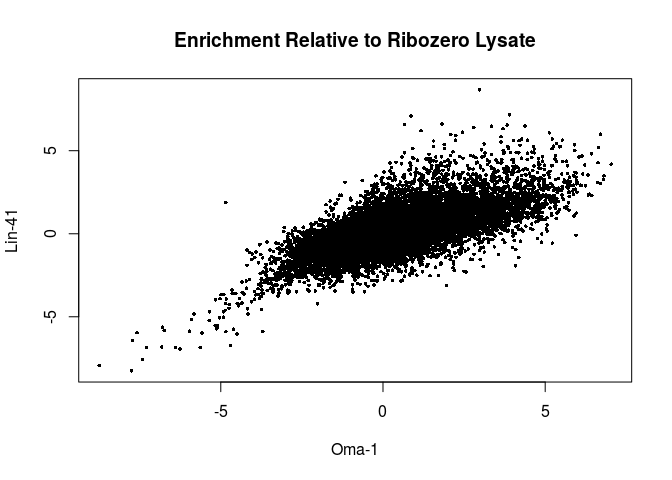<!-- -->

```r
plot(res_dds87q4[,2],res_dds87q4[,1],cex=0.5,pch=16,xlab="Oma-1",ylab="Oma-1 042310",
     main="Enrichment Relative to Ribozero Lysate")
```

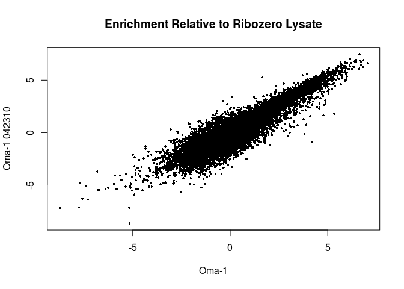<!-- -->


## MAKE A Master Table with MAPQ FLAG, Biotype, and mean FPKM per sample

```r
#Add annotation information

idx<-match(rownames(res_dds87q4),anno87$ensembl_gene_id)
res_dds87q4$biotype<-anno87[idx,"transcript_biotype"]
res_dds87q4$name<-anno87[idx,"wikigene_name"]
res_dds87q4$external_name<-anno87[idx,"external_gene_name"]


lfc<-2  # also note not using abs() here -- just want enrichment
p<-0.05
length(oma1_genes<-rownames(subset(res_Oma1_dds87,log2FoldChange > lfc & padj < p)))
```

```
## [1] 1524
```

```r
length(oma1q4_genes<-rownames(subset(res_Oma1_dds87q4,log2FoldChange > lfc & padj < p)))
```

```
## [1] 1472
```

```r
length(lin41_genes<-rownames(subset(res_Lin41_dds87,log2FoldChange > lfc & padj < p)))
```

```
## [1] 643
```

```r
length(lin41q4_genes<-rownames(subset(res_Lin41_dds87q4,log2FoldChange > lfc & padj < p)))
```

```
## [1] 625
```

```r
#Find genes with different result due to MAPQ filter

length(mapq_effected_genes<-setdiff(sort(unique(c(oma1_genes,lin41_genes))),sort(unique(c(oma1q4_genes,lin41q4_genes)))))
```

```
## [1] 64
```

```r
res_dds87q4$mapq_effect <- rownames(res_dds87q4) %in% mapq_effected_genes

#Add FPKMs
dds87q4_fpkm<-as.data.frame(fpkm(dds87q4))
(lysRZ_columns<-which(colData(dds87q4)[colnames(dds87q4),"tag"]=="LysRZ"))
```

```
## [1] 3 7
```

```r
(oma1_columns<-which(colData(dds87q4)[colnames(dds87q4),"tag"]=="OMA-1"))
```

```
## [1] 1 2
```

```r
(lin41_columns<-which(colData(dds87q4)[colnames(dds87q4),"tag"]=="LIN-41"))
```

```
## [1] 5 6
```

```r
dds87q4_fpkm$lysRZ<-apply(dds87q4_fpkm,1,function(x) mean(x[lysRZ_columns]))
dds87q4_fpkm$oma1<-apply(dds87q4_fpkm,1,function(x) mean(x[oma1_columns]))
dds87q4_fpkm$lin41<-apply(dds87q4_fpkm,1,function(x) mean(x[lin41_columns]))

idx<-match(rownames(res_dds87q4),rownames(dds87q4_fpkm))
res_dds87q4$oma1_042310_fpkm<-round(dds87q4_fpkm[idx,"OMA-1_042310"],2)
res_dds87q4$lysRZ_fpkm<-round(dds87q4_fpkm[idx,"lysRZ"],2)
res_dds87q4$oma1_fpkm<-round(dds87q4_fpkm[idx,"oma1"],2)
res_dds87q4$lin41_fpkm<-round(dds87q4_fpkm[idx,"lin41"],2)
```

## Heatmaps of High Log2FC or High Variance Genes

```r
#log2 fold change in eiter sample
dim(temp<-res_dds87q4[!(is.na(res_dds87q4[,2]) | is.na(res_dds87q4[,3])),])
```

```
## [1] 24233    11
```

```r
dim(temp<-temp[temp[,2]>2 | temp[,3] > 2,])
```

```
## [1] 2781   11
```

```r
pheatmap(temp[,1:3],show_rownames=F)
```

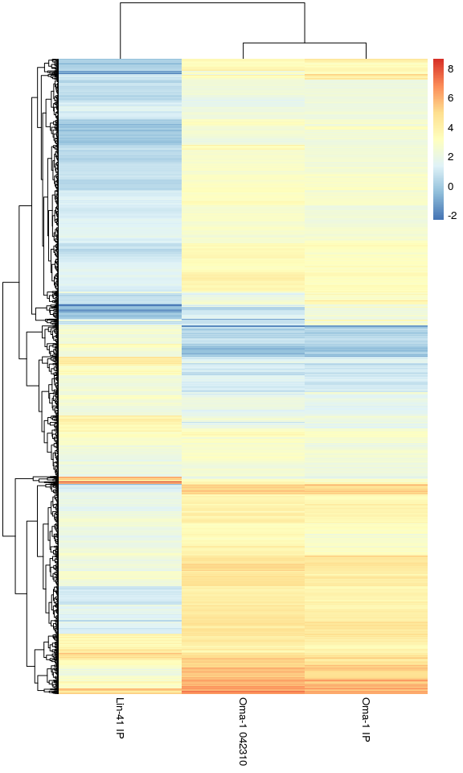<!-- -->

```r
#just samples with highest variance between Oma-1 and Lin-41
dim(temp<-temp[rowVars(temp[,2:3])>8.5,]) #arbitrary cutoff to get a readable gene list
```

```
## [1] 45 11
```

```r
pheatmap(temp[,1:3],labels_row=temp$external_name)
```

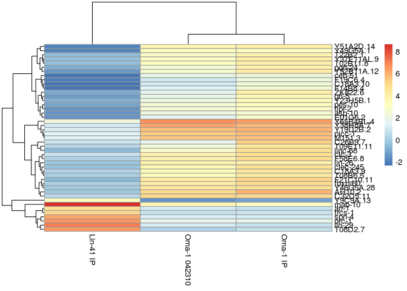<!-- -->

#Venn Diagrams - with p-values

```r
x1<-length(oma1_genes)
y1<-length(lin41_genes)
z1<-sum(oma1_genes %in% lin41_genes)
grid.newpage()
vennplot <- draw.pairwise.venn(x1,y1,z1, c("Oma-1", "Lin-41"))
```

<!-- -->

```r
x2<-length(oma1q4_genes)
y2<-length(lin41q4_genes)
z2<-length(overlapq4<-oma1q4_genes[oma1q4_genes %in% lin41q4_genes])
x21<-length(oma1q4_genes_exclusive<-oma1q4_genes[!oma1q4_genes %in% overlapq4])
y21<-length(lin41q4_genes_exclusive<-lin41q4_genes[!lin41q4_genes %in% overlapq4])
grid.newpage()
vennplot <- draw.pairwise.venn(x2,y2,z2, c("Oma-1", "Lin-41"))
```

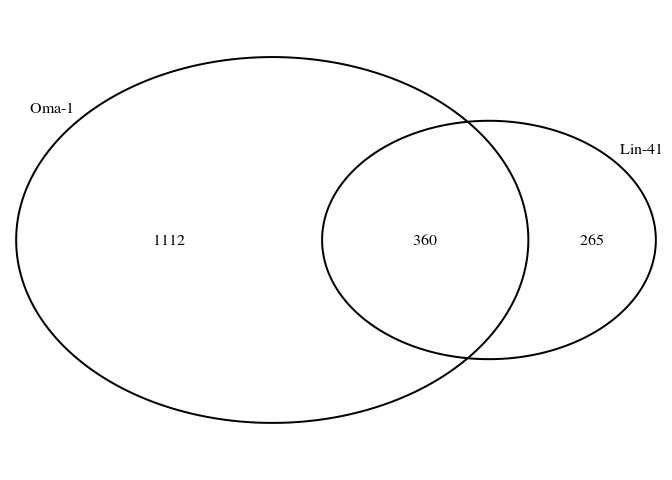<!-- -->

## Use scatterplot to visualize relationships in Venn Diagram

```r
plot(res_dds87q4[,2],res_dds87q4[,3],cex=0.5,pch=16,ylim=c(-7,7),xlim=c(-7,7),main="Oma-1 vs Lin-41 Enrichment", 
     ylab="LIN-41 Log2Fold Change",xlab="OMA-1 Log2Fold Change",
     col=ifelse(rownames(res_dds87q4) %in% overlapq4,"blue",
                ifelse(rownames(res_dds87q4) %in% oma1q4_genes_exclusive,"green",
                ifelse(rownames(res_dds87q4) %in% lin41q4_genes_exclusive,"red","black"))))
abline(a=0,b=1,col="red")
```

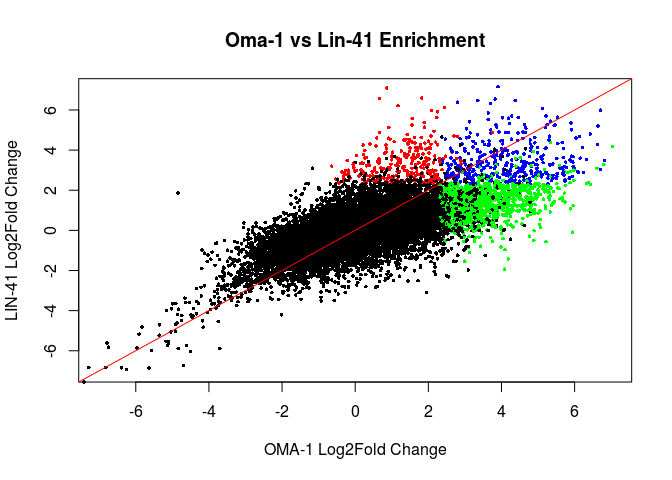<!-- -->

## Visualise as smoothScatter


```r
Lab.palette <- colorRampPalette(c("white", "orange", "red"), space = "Lab")

#jpeg("oma1_vs_lin41_scatter.jpg",width=600,height=600,type="cairo")
#svglite("testplot.svg",width=8,height=8)
i.s<-smoothScatter(res_dds87q4$`Oma-1 IP`,res_dds87q4$`Lin-41 IP`, colramp = Lab.palette,
                     ## pch=NA: do not draw them
                     xlab=("Log2 Oma-1 Enrichment"),
                     ylab=("Log2 Lin-41 Enrichment"),
                     nrpoints = 100, ret.selection=TRUE,main="Relative Enrichment in IP's")
#identify(temp$Oma.1.IP,temp$Lin.41.IP, labels=temp$Gene.Name)
gene_list<-c("spn-4","cdc-25.3","lin-29","zif-1","rnp-1")
for ( g in gene_list ){
  x<-res_dds87q4[grep(g,res_dds87q4$'name'),'Oma-1 IP']
  y<-res_dds87q4[grep(g,res_dds87q4$'name'),'Lin-41 IP']
  print(x)
  print(y)
  print(g)
  text(x,y,g)
  }
```

```
## [1] 1.171641
## [1] 6.214094
## [1] "spn-4"
## [1] 5.125417
## [1] 6.076521
## [1] "cdc-25.3"
## [1] 0.8602293
## [1] 7.09693
## [1] "lin-29"
## [1] 5.251027
## [1] 5.272734
## [1] "zif-1"
## [1] 5.959066
## [1] 3.193639
## [1] "rnp-1"
```

```r
abline(h=2,col="red")
abline(v=2,col="red")
```

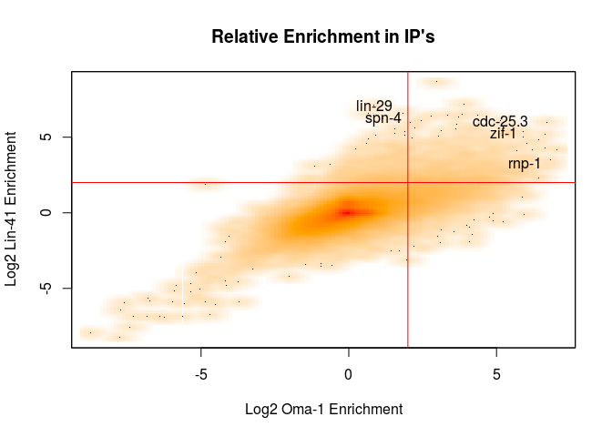<!-- -->


#Now run GO Analysis on each section of Venn Diagram
## GO Analysis

```r
downloader::download("ftp://ftp.wormbase.org/pub/wormbase/releases/WS257/ONTOLOGY/gene_association.WS257.wb",
                     "gene_association.WS257.wb")
downloader::download("ftp://ftp.wormbase.org/pub/wormbase/releases/WS257/ONTOLOGY/gene_ontology.WS257.obo",
                     "gene_ontology.WS257.obo")

ga<-readr::read_delim("gene_association.WS257.wb",skip=3,delim="\t",col_names=F)

#Scan in OBO file to get Biological Process terms
t1<-readLines("gene_ontology.WS257.obo",n=-1L)
terms<-list()

for (i in seq_along(1:length(t1))) {
  if (t1[i]=="[Term]") {
    gt<-substr(t1[i+1],5,14)
    name<-gsub("name: ","",t1[i+2])
    if (t1[i+3]=="namespace: biological_process") { 
      #print (paste0(gt,":  ",name)) 
      terms[[gt]]<-name
    }
    }
}
go_terms<-unlist(terms)

head(ga)
wb_go<-ga[ga$'X5' %in% names(go_terms),c('X2','X5')]
colnames(wb_go)<-c("ensembl","GO ID")
dim(wb_go<-as.data.frame(wb_go))
#remove duplicated entries (possibly from multiple lines of evidence)
dim(wb_go<-wb_go[!duplicated(wb_go),])

wb_go.list<-split(wb_go$`GO ID`,wb_go$ensembl)

#List Terms for a gene
anno87[grep("lin-41",anno87$wikigene_name),]
go_terms[wb_go.list[["WBGene00003026"]]]

anno87[grep("lin-29",anno87$wikigene_name),]
go_terms[wb_go.list[["WBGene00003015"]]]

#List Genes for a Term
anno87[anno87$ensembl_gene_id %in% wb_go[grep("GO:0045138",wb_go$`GO ID`),"ensembl"],]

save(wb_go,go_terms,file="wb_257_goterms.rdata")
```

## GO Analysis of each VENN category

```r
load("wb_257_goterms.rdata")
length(expressed_genes<-rownames(res_Lin41_dds87q4[res_Lin41_dds87q4$baseMean > 1,]))
```

```
## [1] 16031
```

```r
#alternatively insist on enough data to define p-value
#length(expressed_genes<-rownames(res_Lin41_dds87q4[res_Lin41_dds87q4$baseMean > 1 & !is.na(res_Lin41_dds87q4$log2FoldChange) & !is.na(res_Lin41_dds87q4$padj) & !is.na(res_Oma1_dds87q4$log2FoldChange) & !is.na(res_Oma1_dds87q4$padj),]))

dim(wb_go<-wb_go[wb_go$ensembl %in% expressed_genes,])
```

```
## [1] 42014     2
```

```r
wb_go.list<-split(wb_go$`GO ID`,wb_go$ensembl)

listGO<-function(goid,degs) {
  print(go_terms[goid])
  tg<-wb_go[grep(goid,wb_go$`GO ID`),"ensembl",drop=F]
  idx<-match(tg$ensembl,anno87$ensembl_gene_id)
  tg$symbol<-anno87[idx,"wikigene_name"]
  tg$deg<-degs[tg$ensembl]
  as.data.frame(tg)
}

#degs_temp<-rep(NA,length(expressed_genes))
#names(degs_temp)<-expressed_genes
#listGO("GO:0045138",degs_temp)

#bias data
bd<-sum(width(reduce(ens87)))
bd<-bd[names(bd) %in% expressed_genes]

#GOseq - Lin41 exclusive
table(degs_lin41<-as.numeric(expressed_genes %in% lin41q4_genes_exclusive ))
```

```
## 
##     0     1 
## 15766   265
```

```r
names(degs_lin41)<-expressed_genes
lin41_GO<-goseq(nullp(degs_lin41,bias.data=bd),gene2cat=wb_go.list)
```

```
## Warning in pcls(G): initial point very close to some inequality constraints
```

```
## Using manually entered categories.
```

```
## For 6821 genes, we could not find any categories. These genes will be excluded.
```

```
## To force their use, please run with use_genes_without_cat=TRUE (see documentation).
```

```
## This was the default behavior for version 1.15.1 and earlier.
```

```
## Calculating the p-values...
```

```
## 'select()' returned 1:1 mapping between keys and columns
```

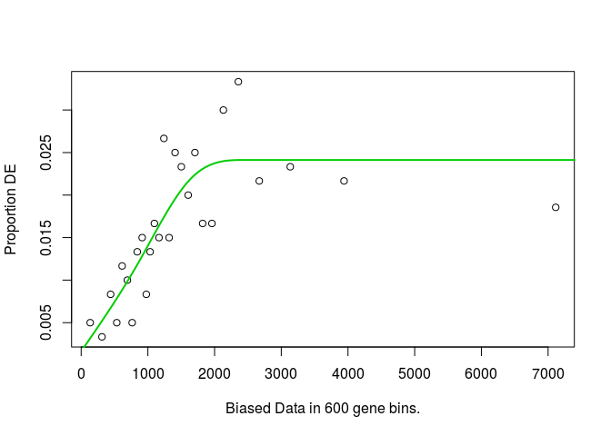<!-- -->

```r
lin41_GO[1:10,c("category","term","numDEInCat","numInCat","over_represented_pvalue")]
```

```
##        category                                               term
## 957  GO:0009792 embryo development ending in birth or egg hatching
## 3002 GO:1903864                              P granule disassembly
## 752  GO:0007276                                  gamete generation
## 657  GO:0007049                                         cell cycle
## 2218 GO:0046777                        protein autophosphorylation
## 17   GO:0000070               mitotic sister chromatid segregation
## 1803 GO:0040010                 positive regulation of growth rate
## 960  GO:0009880                    embryonic pattern specification
## 577  GO:0006865                               amino acid transport
## 2069 GO:0045144               meiotic sister chromatid segregation
##      numDEInCat numInCat over_represented_pvalue
## 957          84     2901            1.468780e-05
## 3002          3        3            1.583677e-05
## 752           9      102            2.412487e-04
## 657          11      143            2.553715e-04
## 2218          4       16            4.790261e-04
## 17            4       22            1.628144e-03
## 1803          4       24            1.775413e-03
## 960           3       12            2.165600e-03
## 577           2        4            2.983620e-03
## 2069          2        4            3.387102e-03
```

```r
listGO("GO:1903864",degs_lin41)
```

```
##              GO:1903864 
## "P granule disassembly"
```

```
##              ensembl symbol deg
## 20516 WBGene00003150  mbk-2   1
## 49111 WBGene00010492  meg-1   1
## 49124 WBGene00010493  meg-2   1
```

```r
#GOseq - Oma1 exclusive
table(degs_oma1<-as.numeric(expressed_genes %in% oma1q4_genes_exclusive ))
```

```
## 
##     0     1 
## 14919  1112
```

```r
names(degs_oma1)<-expressed_genes
oma1_GO<-goseq(nullp(degs_oma1,bias.data=bd),gene2cat=wb_go.list)
```

```
## Warning in pcls(G): initial point very close to some inequality constraints
```

```
## Using manually entered categories.
```

```
## For 6821 genes, we could not find any categories. These genes will be excluded.
```

```
## To force their use, please run with use_genes_without_cat=TRUE (see documentation).
```

```
## This was the default behavior for version 1.15.1 and earlier.
```

```
## Calculating the p-values...
```

```
## 'select()' returned 1:1 mapping between keys and columns
```

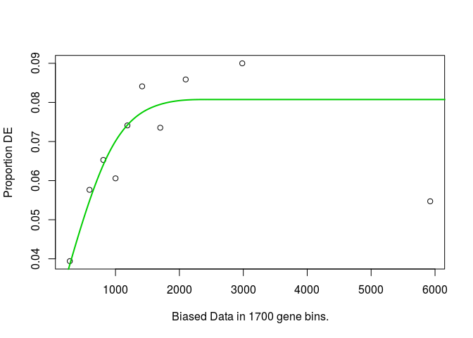<!-- -->

```r
oma1_GO[1:10,c("category","term","numDEInCat","numInCat","over_represented_pvalue")]
```

```
##        category
## 1701 GO:0034975
## 734  GO:0007219
## 1188 GO:0016540
## 874  GO:0008654
## 957  GO:0009792
## 1136 GO:0016024
## 382  GO:0006417
## 594  GO:0006893
## 136  GO:0001708
## 494  GO:0006616
##                                                                            term
## 1701                                   protein folding in endoplasmic reticulum
## 734                                                     Notch signaling pathway
## 1188                                                     protein autoprocessing
## 874                                           phospholipid biosynthetic process
## 957                          embryo development ending in birth or egg hatching
## 1136                                    CDP-diacylglycerol biosynthetic process
## 382                                                   regulation of translation
## 594                                          Golgi to plasma membrane transport
## 136                                                     cell fate specification
## 494  SRP-dependent cotranslational protein targeting to membrane, translocation
##      numDEInCat numInCat over_represented_pvalue
## 1701          5        5            2.961010e-06
## 734           7       16            1.554124e-04
## 1188          4        5            2.864469e-04
## 874           8       23            4.020417e-04
## 957         278     2901            5.932336e-04
## 1136          4        6            6.402904e-04
## 382           9       30            7.005836e-04
## 594           4        6            8.256858e-04
## 136          12       50            8.431261e-04
## 494           3        4            1.077043e-03
```

```r
listGO("GO:0007219",degs_oma1)
```

```
##                GO:0007219 
## "Notch signaling pathway"
```

```
##              ensembl  symbol deg
## 637   WBGene00000075   adm-4   0
## 1202  WBGene00000147   aph-1   1
## 1221  WBGene00000148   aph-2   0
## 12552 WBGene00001609   glp-1   1
## 14978 WBGene00001965  hlh-26   0
## 15253 WBGene00001985   hop-1   0
## 17334 WBGene00002245   lag-1   1
## 18865 WBGene00003001  lin-12   0
## 19572 WBGene00003043   lip-1   0
## 26123 WBGene00003975   pen-2   1
## 31403 WBGene00004769  sel-12   1
## 33135 WBGene00004958   spe-4   0
## 35400 WBGene00006324  sup-17   0
## 50632 WBGene00011195   sao-1   1
## 58728 WBGene00015793 C15C7.7   1
## 66329 WBGene00019514 K08B4.2   0
```

```r
#GOseq - overlap
table(degs_overlap<-as.numeric(expressed_genes %in% overlapq4 ))
```

```
## 
##     0     1 
## 15671   360
```

```r
names(degs_overlap)<-expressed_genes
overlap_GO<-goseq(nullp(degs_overlap,bias.data=bd),gene2cat=wb_go.list)
```

```
## Warning in pcls(G): initial point very close to some inequality constraints
```

```
## Using manually entered categories.
```

```
## For 6821 genes, we could not find any categories. These genes will be excluded.
```

```
## To force their use, please run with use_genes_without_cat=TRUE (see documentation).
```

```
## This was the default behavior for version 1.15.1 and earlier.
```

```
## Calculating the p-values...
```

```
## 'select()' returned 1:1 mapping between keys and columns
```

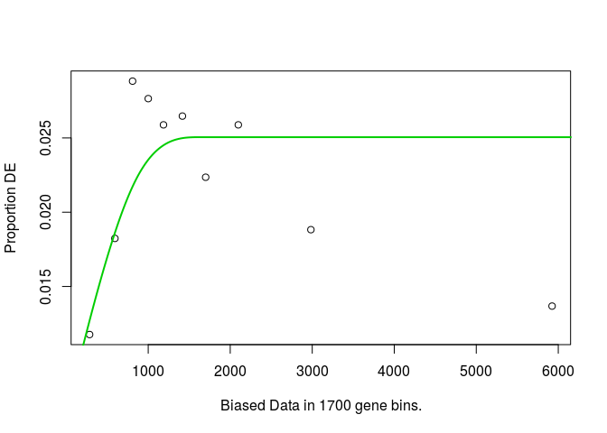<!-- -->

```r
overlap_GO[1:10,c("category","term","numDEInCat","numInCat","over_represented_pvalue")]
```

```
##        category
## 788  GO:0007548
## 25   GO:0000122
## 1365 GO:0030154
## 787  GO:0007538
## 1906 GO:0042787
## 899  GO:0009165
## 425  GO:0006486
## 1216 GO:0017196
## 754  GO:0007283
## 804  GO:0007614
##                                                                                  term
## 788                                                               sex differentiation
## 25               negative regulation of transcription from RNA polymerase II promoter
## 1365                                                             cell differentiation
## 787                                                         primary sex determination
## 1906 protein ubiquitination involved in ubiquitin-dependent protein catabolic process
## 899                                                   nucleotide biosynthetic process
## 425                                                             protein glycosylation
## 1216                                       N-terminal peptidyl-methionine acetylation
## 754                                                                   spermatogenesis
## 804                                                                 short-term memory
##      numDEInCat numInCat over_represented_pvalue
## 788           6       24            2.127166e-05
## 25            9       89            3.494933e-04
## 1365         12      150            3.548802e-04
## 787           2        3            1.899529e-03
## 1906          6       58            2.987750e-03
## 899           2        5            5.362982e-03
## 425           6       66            5.523887e-03
## 1216          2        5            5.592642e-03
## 754           5       46            5.679704e-03
## 804           3       15            5.839474e-03
```

```r
#horizontal bar plot
head(lin41_GO,10) %>%
  dplyr::mutate(term=factor(term,levels=rev(term))) %>%
  ggplot(aes(x=term,y=-log10(over_represented_pvalue))) +
  geom_bar(stat="identity",fill="red") +
  coord_flip() + xlab("") + ggtitle("Enriched GO terms LIN-41 Exclusive Set") +
  theme_bw()
```

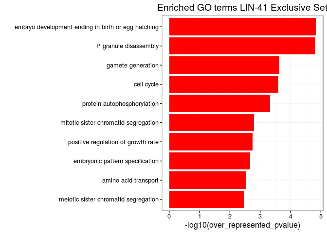<!-- -->

```r
listGO("GO:0007538",degs_overlap)
```

```
##                  GO:0007538 
## "primary sex determination"
```

```
##              ensembl symbol deg
## 4087  WBGene00000460 ceh-39   1
## 11321 WBGene00001484  fox-1   0
## 31629 WBGene00004786  sex-1   1
```


## MOTIF ANALYSIS

# Download UTR sequences from biomaRt

```r
#get transcript identifiers for all expressed genes
expressed_transcripts<-getBM(filters="ensembl_gene_id",values=expressed_genes, attributes=c("ensembl_gene_id","ensembl_transcript_id"), mart=ensembl_87)

seq3utr<-getSequence(id = expressed_transcripts$ensembl_transcript_id, type = "ensembl_transcript_id", seqType = "3utr", mart = ensembl_87)
seq5utr<-getSequence(id = expressed_transcripts$ensembl_transcript_id, type = "ensembl_transcript_id", seqType = "5utr", mart = ensembl_87)
save(seq3utr,seq5utr,expressed_transcripts,file="utr_sequences.rdata")
```

# Search for OMA-1 and LIN-41 Motifs in 3' UTRs

```r
load("utr_sequences.rdata")

#clean up UTR sequences
seq3utr<-seq3utr[seq3utr$`3utr`!="Sequence unavailable",]
seq3utr<-seq3utr[nchar(seq3utr$`3utr`) >=8,]  # get rid of really short 3'UTRs

# add geneid to dataframe
summary(idx<-match(seq3utr$ensembl_transcript_id,expressed_transcripts$ensembl_transcript_id))
```

```
##    Min. 1st Qu.  Median    Mean 3rd Qu.    Max. 
## 
```

```r
seq3utr$ensembl_gene_id<-expressed_transcripts[idx,"ensembl_gene_id"]
sum(duplicated(paste0(seq3utr$`3utr`,seq3utr$ensembl_transcript_id)))
```

```
## [1] 0
```

```r
sum(duplicated(paste0(seq3utr$`3utr`,seq3utr$ensembl_gene_id)))
```

```
## [1] 0
```

```r
seq3utr<-seq3utr[!duplicated(paste0(seq3utr$`3utr`,seq3utr$ensembl_gene_id)),]

seq3utrBS<-DNAStringSet(seq3utr$`3utr`)
names(seq3utrBS)<-seq3utr$ensembl_transcript_id
summary(width(seq3utrBS))
```

```
##    Min. 1st Qu.  Median    Mean 3rd Qu.    Max. 
## 
```

```r
seq3utr<-seq3utr[,-1]  #drop sequence from dataframe

#Count TAW motif and RNACompete Motif in each transcript
seq3utr$taw<-vcountPattern("TAW",seq3utrBS,fixed=FALSE)
table(as.logical(seq3utr$taw))
```

```
## < table of extent 0 >
```

```r
#Count RNAcompete motif in each transcript
rnaCompeteMotif<-RNAStringSet(c("GCAAAGC","GUAAAAC","GUAUAAC","GCAUAGC","CUUUAAG"))
temp<-consensusMatrix(rnaCompeteMotif)[1:4,]
plotMotifLogo(new("pfm",mat=t(t(temp[1:4,])*1/colSums(temp[1:4,])), name="RNAcompeteMotif"))
```

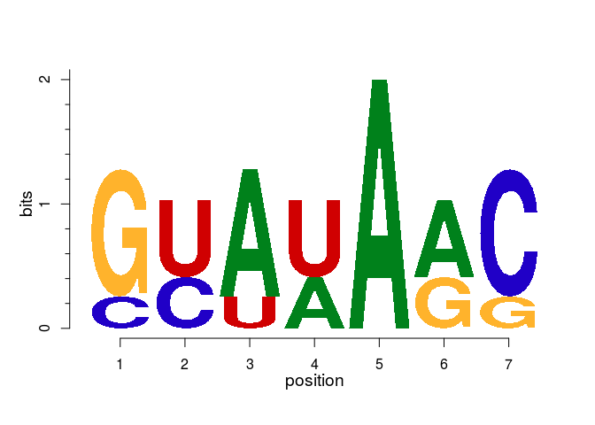<!-- -->

```r
lin41_consensusMatrix<-consensusMatrix(DNAStringSet(rnaCompeteMotif))[1:4,]

seq3utr$loedige<-unlist(lapply(seq3utrBS,function(x) countPWM(lin41_consensusMatrix,x,min.score="90%")))
table(as.logical(seq3utr$loedige))
```

```
## < table of extent 0 >
```

```r
#oma-1 TAW
temp<-seq3utr %>% group_by(ensembl_gene_id) %>% 
  summarize(taw_log=as.logical(sum(taw)),loedige_log=as.logical(sum(loedige))) %>% as.data.frame

a<-sum(temp[temp$ensembl_gene_id %in% oma1_genes,"taw_log"])
b<-sum(temp[!temp$ensembl_gene_id %in% oma1_genes,"taw_log"])
c<-sum(oma1_genes %in% temp$ensembl_gene_id)
d<-sum(expressed_genes %in% temp$ensembl_gene_id)

(x<-matrix(c(d-b-c,b,c-a,a),ncol=2))
```

```
##      [,1] [,2]
## [1,]    0    0
## [2,]    0    0
```

```r
(oma1_taw_3p_test<-fisher.test(x))
```

```
## 
## 	Fisher's Exact Test for Count Data
## 
## data:  x
## p-value = 1
## alternative hypothesis: true odds ratio is not equal to 1
## 95 percent confidence interval:
##    0 Inf
## sample estimates:
## odds ratio 
##          0
```

```r
#oma-1 loedige
a<-sum(temp[temp$ensembl_gene_id %in% oma1_genes,"loedige_log"])
b<-sum(temp[!temp$ensembl_gene_id %in% oma1_genes,"loedige_log"])
c<-sum(oma1_genes %in% temp$ensembl_gene_id)
d<-sum(expressed_genes %in% temp$ensembl_gene_id)

(x<-matrix(c(d-b-c,b,c-a,a),ncol=2))
```

```
##      [,1] [,2]
## [1,]    0    0
## [2,]    0    0
```

```r
(oma1_loedige_3p_test<-fisher.test(x))
```

```
## 
## 	Fisher's Exact Test for Count Data
## 
## data:  x
## p-value = 1
## alternative hypothesis: true odds ratio is not equal to 1
## 95 percent confidence interval:
##    0 Inf
## sample estimates:
## odds ratio 
##          0
```

```r
#lin41 TAW
a<-sum(temp[temp$ensembl_gene_id %in% lin41_genes,"taw_log"])
b<-sum(temp[!temp$ensembl_gene_id %in% lin41_genes,"taw_log"])
c<-sum(lin41_genes %in% temp$ensembl_gene_id)
d<-sum(expressed_genes %in% temp$ensembl_gene_id)

(x<-matrix(c(d-b-c,b,c-a,a),ncol=2))
```

```
##      [,1] [,2]
## [1,]    0    0
## [2,]    0    0
```

```r
(lin41_taw_3p_test<-fisher.test(x))
```

```
## 
## 	Fisher's Exact Test for Count Data
## 
## data:  x
## p-value = 1
## alternative hypothesis: true odds ratio is not equal to 1
## 95 percent confidence interval:
##    0 Inf
## sample estimates:
## odds ratio 
##          0
```

```r
#lin41 loedige
a<-sum(temp[temp$ensembl_gene_id %in% lin41_genes,"loedige_log"])
b<-sum(temp[!temp$ensembl_gene_id %in% lin41_genes,"loedige_log"])
c<-sum(lin41_genes %in% temp$ensembl_gene_id)
d<-sum(expressed_genes %in% temp$ensembl_gene_id)

(x<-matrix(c(d-b-c,b,c-a,a),ncol=2))
```

```
##      [,1] [,2]
## [1,]    0    0
## [2,]    0    0
```

```r
(lin41_loedige_3p_test<-fisher.test(x))
```

```
## 
## 	Fisher's Exact Test for Count Data
## 
## data:  x
## p-value = 1
## alternative hypothesis: true odds ratio is not equal to 1
## 95 percent confidence interval:
##    0 Inf
## sample estimates:
## odds ratio 
##          0
```

```r
print(paste0("TAW motif enrichment in 3' UTR of Oma1 Enriched Genes:  ",oma1_taw_3p_test$p.value))
```

```
## [1] "TAW motif enrichment in 3' UTR of Oma1 Enriched Genes:  1"
```

```r
print(paste0("RNAcompete Lin-41 motif enrichment in 3' UTR of Oma1 Enriched Genes:  ",oma1_loedige_3p_test$p.value))
```

```
## [1] "RNAcompete Lin-41 motif enrichment in 3' UTR of Oma1 Enriched Genes:  1"
```

```r
print(paste0("TAW motif enrichment in 3' UTR of Lin-41 Enriched Genes:  ",lin41_taw_3p_test$p.value))
```

```
## [1] "TAW motif enrichment in 3' UTR of Lin-41 Enriched Genes:  1"
```

```r
print(paste0("RNACompete Lin-41 motif enrichment in 3' UTR of Lin-41 Enriched Genes:  ",lin41_loedige_3p_test$p.value))
```

```
## [1] "RNACompete Lin-41 motif enrichment in 3' UTR of Lin-41 Enriched Genes:  1"
```

## Search for OMA-1 and LIN-41 Motifs in 5' UTRs 

```r
#clean up UTR sequences
seq5utr<-seq5utr[seq5utr$`5utr`!="Sequence unavailable",]
seq5utr<-seq5utr[nchar(seq5utr$`5utr`) >=8,]  # get rid of really short 3'UTRs

# add geneid to dataframe
summary(idx<-match(seq5utr$ensembl_transcript_id,expressed_transcripts$ensembl_transcript_id))
```

```
##    Min. 1st Qu.  Median    Mean 3rd Qu.    Max. 
##       3    6052   12500   12750   19320   27290
```

```r
seq5utr$ensembl_gene_id<-expressed_transcripts[idx,"ensembl_gene_id"]
sum(duplicated(paste0(seq5utr$`5utr`,seq5utr$ensembl_transcript_id)))
```

```
## [1] 0
```

```r
sum(duplicated(paste0(seq5utr$`5utr`,seq5utr$ensembl_gene_id)))
```

```
## [1] 2539
```

```r
seq5utr<-seq5utr[!duplicated(paste0(seq5utr$`5utr`,seq5utr$ensembl_gene_id)),]

seq5utrBS<-DNAStringSet(seq5utr$`5utr`)
names(seq5utrBS)<-seq5utr$ensembl_transcript_id
summary(width(seq5utrBS))
```

```
##    Min. 1st Qu.  Median    Mean 3rd Qu.    Max. 
##    8.00   22.00   54.00   98.38  124.00 1836.00
```

```r
seq5utr<-seq5utr[,-1]  #drop sequence from dataframe

#Count TAW motif and RNACompete Motif in each transcript
seq5utr$taw<-vcountPattern("TAW",seq5utrBS,fixed=FALSE)
table(as.logical(seq5utr$taw))
```

```
## 
## FALSE  TRUE 
##  3556  8822
```

```r
#Count RNAcompete motif in each transcript
seq5utr$loedige<-unlist(lapply(seq5utrBS,function(x) countPWM(lin41_consensusMatrix,x,min.score="90%")))
table(as.logical(seq5utr$loedige))
```

```
## 
## FALSE  TRUE 
## 12053   325
```

```r
#oma-1 TAW
temp<-seq5utr %>% group_by(ensembl_gene_id) %>% 
  summarize(taw_log=as.logical(sum(taw)),loedige_log=as.logical(sum(loedige))) %>% as.data.frame

a<-sum(temp[temp$ensembl_gene_id %in% oma1_genes,"taw_log"])
b<-sum(temp[!temp$ensembl_gene_id %in% oma1_genes,"taw_log"])
c<-sum(oma1_genes %in% temp$ensembl_gene_id)
d<-sum(expressed_genes %in% temp$ensembl_gene_id)

(x<-matrix(c(d-b-c,b,c-a,a),ncol=2))
```

```
##      [,1] [,2]
## [1,] 2161  239
## [2,] 5741  679
```

```r
(oma1_taw_5p_test<-fisher.test(x))
```

```
## 
## 	Fisher's Exact Test for Count Data
## 
## data:  x
## p-value = 0.4108
## alternative hypothesis: true odds ratio is not equal to 1
## 95 percent confidence interval:
##  0.913618 1.254813
## sample estimates:
## odds ratio 
##   1.069393
```

```r
#oma-1 loedige
a<-sum(temp[temp$ensembl_gene_id %in% oma1_genes,"loedige_log"])
b<-sum(temp[!temp$ensembl_gene_id %in% oma1_genes,"loedige_log"])
c<-sum(oma1_genes %in% temp$ensembl_gene_id)
d<-sum(expressed_genes %in% temp$ensembl_gene_id)

(x<-matrix(c(d-b-c,b,c-a,a),ncol=2))
```

```
##      [,1] [,2]
## [1,] 7672  889
## [2,]  230   29
```

```r
(oma1_loedige_5p_test<-fisher.test(x))
```

```
## 
## 	Fisher's Exact Test for Count Data
## 
## data:  x
## p-value = 0.6791
## alternative hypothesis: true odds ratio is not equal to 1
## 95 percent confidence interval:
##  0.7082234 1.6169608
## sample estimates:
## odds ratio 
##   1.088141
```

```r
#lin41 TAW
a<-sum(temp[temp$ensembl_gene_id %in% lin41_genes,"taw_log"])
b<-sum(temp[!temp$ensembl_gene_id %in% lin41_genes,"taw_log"])
c<-sum(lin41_genes %in% temp$ensembl_gene_id)
d<-sum(expressed_genes %in% temp$ensembl_gene_id)

(x<-matrix(c(d-b-c,b,c-a,a),ncol=2))
```

```
##      [,1] [,2]
## [1,] 2291  109
## [2,] 6129  291
```

```r
(lin41_taw_5p_test<-fisher.test(x))
```

```
## 
## 	Fisher's Exact Test for Count Data
## 
## data:  x
## p-value = 1
## alternative hypothesis: true odds ratio is not equal to 1
## 95 percent confidence interval:
##  0.793688 1.262094
## sample estimates:
## odds ratio 
##  0.9979345
```

```r
#lin41 loedige
a<-sum(temp[temp$ensembl_gene_id %in% lin41_genes,"loedige_log"])
b<-sum(temp[!temp$ensembl_gene_id %in% lin41_genes,"loedige_log"])
c<-sum(lin41_genes %in% temp$ensembl_gene_id)
d<-sum(expressed_genes %in% temp$ensembl_gene_id)

(x<-matrix(c(d-b-c,b,c-a,a),ncol=2))
```

```
##      [,1] [,2]
## [1,] 8176  385
## [2,]  244   15
```

```r
(lin41_loedige_5p_test<-fisher.test(x))
```

```
## 
## 	Fisher's Exact Test for Count Data
## 
## data:  x
## p-value = 0.2905
## alternative hypothesis: true odds ratio is not equal to 1
## 95 percent confidence interval:
##  0.7123876 2.2238943
## sample estimates:
## odds ratio 
##   1.305468
```

```r
print(paste0("TAW motif enrichment in 5' UTR of Oma1 Enriched Genes:  ",oma1_taw_5p_test$p.value))
```

```
## [1] "TAW motif enrichment in 5' UTR of Oma1 Enriched Genes:  0.410839678430791"
```

```r
print(paste0("RNAcompete Lin-41 motif enrichment in 5' UTR of Oma1 Enriched Genes:  ",oma1_loedige_5p_test$p.value))
```

```
## [1] "RNAcompete Lin-41 motif enrichment in 5' UTR of Oma1 Enriched Genes:  0.679097893626047"
```

```r
print(paste0("TAW motif enrichment in Lin-41 5' UTR of Enriched Genes:  ",lin41_taw_5p_test$p.value))
```

```
## [1] "TAW motif enrichment in Lin-41 5' UTR of Enriched Genes:  1"
```

```r
print(paste0("RNACompete Lin-41 motif enrichment in 5' UTR of Lin-41 Enriched Genes:  ",lin41_loedige_5p_test$p.value))
```

```
## [1] "RNACompete Lin-41 motif enrichment in 5' UTR of Lin-41 Enriched Genes:  0.290523764773253"
```


# MEME de novo explore UTR's of LIN-41 exclusive set

```r
#count UA[A/U]  "TAW" motif in each 5'utr
seq5utr<-getSequence(id = lin41_genesq4_exclusive, type = "ensembl_gene_id", seqType = "5utr", mart = ensembl_87)
seq5utr<-seq5utr[seq5utr$`5utr`!="Sequence unavailable",]
summary(nchar(seq5utr$`5utr`))
seq5utrBS<-DNAStringSet(seq5utr$`5utr`)
seq5utr$taw<-vcountPattern("TAW",seq5utrBS,fixed=FALSE)

#count UA[A/U]  "TAW" motif in each 5'utr
seq3utr<-getSequence(id = lin41_genesq4_exclusive, type = "ensembl_gene_id", seqType = "3utr", mart = ensembl_87)
seq3utr<-seq3utr[seq3utr$`3utr`!="Sequence unavailable",]
summary(nchar(seq3utr$`3utr`))

#count UA[A/U]  "TAW" motif in each 5'utr
seq3utrBS<-DNAStringSet(seq3utr$`3utr`)
seq3utr$taw<-vcountPattern("TAW",seq3utrBS,fixed=FALSE)

rnaCompeteMotif<-RNAStringSet(c("GCAAAGC","GUAAAAC","GUAUAAC","GCAUAGC","CUUUAAG"))
temp<-consensusMatrix(rnaCompeteMotif)[1:4,]
plotMotifLogo(new("pfm",mat=t(t(temp[1:4,])*1/colSums(temp[1:4,])), name="RNAcompeteMotif"))

temp<-consensusMatrix(DNAStringSet(rnaCompeteMotif))[1:4,]
x<-countPWM(temp,seq3utrBS[[1]],min.score="80%", with.score=FALSE)

table(x<-unlist(lapply(seq3utrBS,function(x) countPWM(temp,x,min.score="80%"))))
table(y<-unlist(lapply(seq5utrBS,function(x) countPWM(temp,x,min.score="80%"))))
```

#meme

```r
motifSet <- runMEME(file.path(system.file("extdata",package="TFBSTools"), "crp0.s"),
                    binary="/usr/ngs/bin/meme/bin/meme",arguments=list("-nmotifs"=3))
x<-readDNAStringSet(file.path(system.file("extdata",package="TFBSTools"), "crp0.s"))

motifSet <- runMEME(x, binary="/usr/ngs/bin/meme/bin/meme",arguments=list("-nmotifs"=3))

names(seq3utrBS)<-paste0("seq3utr_",1:length(seq3utrBS))
summary(width(seq3utrBS))
seq3utrBS<-seq3utrBS[width(seq3utrBS)>= 8]
writeXStringSet(seq3utrBS,file="test3p.fasta")
motifSet_3utr <- runMEME(seq3utrBS, binary="/usr/ngs/bin/meme/bin/meme",arguments=list("-nmotifs"=3,"-maxsize"=10000000000000000,"-w"=5))
motifSet_3utr <- runMEME(seq3utrBS, binary="/usr/ngs/bin/meme/bin/meme",arguments=list("-nmotifs"=3,"-maxsize"=10000000000000000))

(temp<-consensusMatrix(motifSet_3utr)[[2]])
rownames(temp)<-c("A","C","G","U")
plotMotifLogo(new("pfm",mat=t(t(temp[1:4,])*1/colSums(temp[1:4,])), name="3'UTR motif"))

seq5utrBS<-seq5utrBS[width(seq5utrBS)>= 8]
names(seq5utrBS)<-paste0("seq5utr_",1:length(seq5utrBS))
writeXStringSet(seq5utrBS,file="test5p.fasta")
motifSet_5utr <- runMEME(seq5utrBS, binary="/usr/ngs/bin/meme/bin/meme",arguments=list("-nmotifs"=3,"-maxsize"=10000000000000000,"-w"=5))
motifSet_5utr <- runMEME(seq5utrBS, binary="/usr/ngs/bin/meme/bin/meme",arguments=list("-nmotifs"=3,"-maxsize"=10000000000000000))
consensusMatrix(motifSet_5utr)

(temp<-consensusMatrix(motifSet_5utr)[[3]])
rownames(temp)<-c("A","C","G","U")
plotMotifLogo(new("pfm",mat=t(t(temp[1:4,])*1/colSums(temp[1:4,])), name="3'UTR motif"))
```

# KIMBLE DATA

"Mon Dec 14 13:55:35 2015"

```r
system("wget 'http://trace.ncbi.nlm.nih.gov/Traces/sra/sra.cgi?save=efetch&rettype=runinfo&db=sra&term=SRP041461' -O sra.csv")
system("wget 'http://trace.ncbi.nlm.nih.gov/Traces/sra/sra.cgi?save=efetch&rettype=runinfo&db=sra&term=SRX527966' -O sra.csv")
View(sra<-read.csv("sra.csv",stringsAsFactors=F))
sqlfile<-"/mnt/gcd/sradb/SRAmetadb.sqlite"
if(!file.exists(sqlfile)) sqlfile <<- getSRAdbFile()
sra_con <- dbConnect(SQLite(),sqlfile)
conversion <- sraConvert('SRP041461', sra_con = sra_con )
samples<-unique(conversion$experiment)
dbListFields(sra_con,"experiment")
sample_names<-list()
#dbGetQuery(sra_con,paste0("select title from experiment where experiment_accession = 'SRX527966'"))

for (i in 1:length(samples)) {
  x<- dbGetQuery(sra_con,paste0("select title from experiment where experiment_accession = '",samples[i],"'"))
  sample_names[[samples[i]]]<-sapply(strsplit(x[1,1],":|;"),function(x) x[2])
}

for (i in samples) {
  x<-conversion[grep(i,conversion$experiment),"run"]
  print(paste0("samtools merge ", i,".bam ", x[1],".bam ",x[2],".bam ",x[3],".bam ",x[4],".bam "))
}

dbGetQuery(sra_con,paste0("select title from experiment where experiment_accession = 'SRX527966'"))
save(sample_names,file="kimble_sample_names.rdata")
```


```r
#Quantitate reads in all the merged SRX files (4 SRR files per SRX file)
(fls <- list.files("../kimble", pattern=glob2rx("SRX*.bam"),full=TRUE))
bamlst <- BamFileList(fls,yieldSize=1e5)
detectCores()
register(MulticoreParam(workers=detectCores()))

kimble87 <-summarizeOverlaps(ens87,bamlst,mode="Union", singleEnd=TRUE,ignore.strand=TRUE)
apply(assays(kimble87)$counts,2,sum)

kimble87_mapq_filter<-summarizeOverlaps(ens87,bamlst,mode="mapq_filter", param=param,
                                 singleEnd=TRUE,ignore.strand=TRUE)
apply(assays(kimble87_mapq_filter)$counts,2,sum)

save(kimble87,kimble87_mapq_filter,file=paste0("kimble87_WBcel235_",ts,".rdata"))
```


```r
load("kimble87_WBcel235_Mon_Feb_06_2017_2213.rdata")
load("kimble_sample_names.rdata")
kimble<-DESeqDataSet(kimble87_mapq_filter,design=~1)
file_names<-colnames(kimble)
colnames(kimble)<-gsub("\\.bam","",file_names)
kimble$title<-unlist(sample_names)[colnames(kimble)]
kimble$filename<-file_names
kimble$sex<-factor(substr(kimble$title,2,4))
#sperm [fem-3(q96)] or oocytes [fog-2(q71)]
design(kimble)<-(~sex)
colData(kimble)
```

```
## DataFrame with 16 rows and 3 columns
##                             title      filename      sex
##                       <character>   <character> <factor>
## SRX527951  q71 gonads Replicate 1 SRX527951.bam      q71
## SRX527952  q71 gonads Replicate 2 SRX527952.bam      q71
## SRX527953  q71 gonads Replicate 3 SRX527953.bam      q71
## SRX527954  q71 gonads Replicate 5 SRX527954.bam      q71
## SRX527955  q71 gonads Replicate 6 SRX527955.bam      q71
## ...                           ...           ...      ...
## SRX527962  q96 gonads Replicate 2 SRX527962.bam      q96
## SRX527963  q96 gonads Replicate 4 SRX527963.bam      q96
## SRX527964  q96 gonads Replicate 5 SRX527964.bam      q96
## SRX527965  q96 gonads Replicate 7 SRX527965.bam      q96
## SRX527966  q96 gonads Replicate 8 SRX527966.bam      q96
```

```r
plotPCA( DESeqTransform( kimble ),intgroup="sex")+
  ggtitle("Kimble Data") + theme_bw()
```

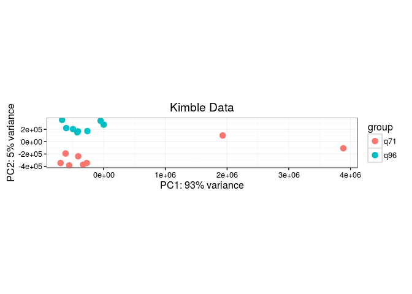<!-- -->

```r
kimble<-DESeq(kimble)
```

```
## estimating size factors
```

```
## estimating dispersions
```

```
## gene-wise dispersion estimates
```

```
## mean-dispersion relationship
```

```
## final dispersion estimates
```

```
## fitting model and testing
```

```
## -- replacing outliers and refitting for 463 genes
## -- DESeq argument 'minReplicatesForReplace' = 7 
## -- original counts are preserved in counts(dds)
```

```
## estimating dispersions
```

```
## fitting model and testing
```

```r
plotMA(kimble)
```

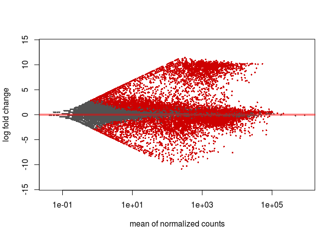<!-- -->

```r
res_kimble<-results(kimble,lfcThreshold=1,contrast=c("sex","q96","q71"))
res_kimble<-as.data.frame(res_kimble)
res_kimble<-res_kimble[!is.na(res_kimble$padj),]
#res<-res[abs(res$log2FoldChange) > 2,]
#dim(res) #1190
head(res_kimble<-res_kimble[with(res_kimble,order(-log2FoldChange)),])
```

```
##                baseMean log2FoldChange     lfcSE     stat       pvalue
## WBGene00019501 321.2708       11.41282 0.7356689 14.15422 1.758899e-45
## WBGene00077699 312.4378       11.37716 0.7244667 14.32385 1.552663e-46
## WBGene00017172 277.3168       11.20451 0.7307200 13.96501 2.548815e-44
## WBGene00008662 450.9630       11.18799 0.7177242 14.19485 9.859678e-46
## WBGene00021115 346.4915       11.16705 0.7275609 13.97415 2.241734e-44
## WBGene00009704 269.3765       11.16354 0.7301395 13.91999 4.789559e-44
##                        padj
## WBGene00019501 1.886596e-44
## WBGene00077699 1.687948e-45
## WBGene00017172 2.696185e-43
## WBGene00008662 1.061418e-44
## WBGene00021115 2.375619e-43
## WBGene00009704 5.042317e-43
```

```r
idx<-match(rownames(res_kimble),anno87$ensembl_gene_id)
res_kimble$name<-anno87[idx,"wikigene_name"]
res_kimble$external_name<-anno87[idx,"external_gene_name"]
res_kimble$type<-anno87[idx,"transcript_biotype"]


plot(res_kimble$log2FoldChange,-1*log10(res_kimble$padj),cex=0.5,pch=16)
```

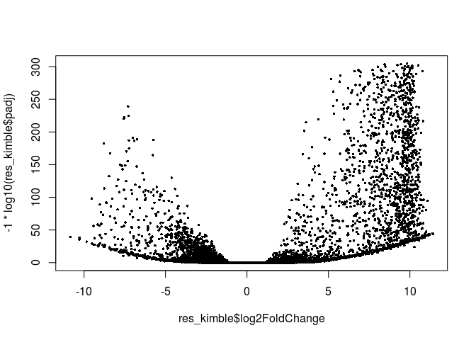<!-- -->

```r
#Get average make and female fpkms
kimble_fpkm<-as.data.frame(fpkm(kimble))
(oocytes<-which(colData(kimble)[colnames(kimble_fpkm),"sex"]=="q71"))
```

```
## [1] 1 2 3 4 5 6 7 8
```

```r
(sperm<-which(colData(kimble)[colnames(kimble_fpkm),"sex"]=="q96"))
```

```
## [1]  9 10 11 12 13 14 15 16
```

```r
kimble_fpkm$oocytes<-apply(kimble_fpkm,1,function(x) mean(x[oocytes]))
kimble_fpkm$sperm<-apply(kimble_fpkm,1,function(x) mean(x[sperm]))

#merge with res
idx<-match(rownames(res_kimble),rownames(kimble_fpkm))
res_kimble$oocyte_fpkm<-round(kimble_fpkm[idx,"oocytes"],3)
res_kimble$sperm_fpkm<-round(kimble_fpkm[idx,"sperm"],3)

genes_of_interest<-c("cpb-1","fog-1","fog-3","oma-1","pie-1","him-3","spo-11","C38C6.8","mab-3","spn-4")
res_kimble[res_kimble$name %in% genes_of_interest,]
```

```
##                   baseMean log2FoldChange      lfcSE       stat
## WBGene00001483  3130.12451      7.7537901 0.33665553  20.061427
## WBGene00003100    51.72019      3.2906149 0.33750878   6.786830
## WBGene00001481  3399.50156      2.4699639 0.16701059   8.801621
## WBGene00000770  5897.65381      1.6428782 0.22119060   2.906445
## WBGene00001862  6265.30342      0.7034515 0.08861342   0.000000
## WBGene00004985  2281.97960     -0.3670576 0.10755490   0.000000
## WBGene00003864 10925.01659     -1.2233780 0.20838911  -1.071927
## WBGene00004984 22127.29091     -2.5840429 0.18002017  -8.799252
## WBGene00004027  2717.89087     -2.9905990 0.15443917 -12.889211
##                      pvalue         padj   name external_name
## WBGene00001483 1.604151e-89 2.332890e-88  fog-3         fog-3
## WBGene00003100 1.146238e-11 7.329528e-11  mab-3         mab-3
## WBGene00001481 1.348542e-18 1.002463e-17  fog-1         fog-1
## WBGene00000770 3.655615e-03 1.539964e-02  cpb-1         cpb-1
## WBGene00001862 1.000000e+00 1.000000e+00  him-3         him-3
## WBGene00004985 1.000000e+00 1.000000e+00 spo-11        spo-11
## WBGene00003864 2.837527e-01 8.086609e-01  oma-1         oma-1
## WBGene00004984 1.377305e-18 1.022554e-17  spn-4         spn-4
## WBGene00004027 5.177057e-38 5.086308e-37  pie-1         pie-1
##                          type oocyte_fpkm sperm_fpkm
## WBGene00001483 protein_coding       0.865    189.287
## WBGene00003100 protein_coding       0.169      1.671
## WBGene00001481 protein_coding      13.923     77.231
## WBGene00000770 protein_coding      40.055    125.239
## WBGene00001862 protein_coding     121.473    197.823
## WBGene00004985 protein_coding      53.873     41.770
## WBGene00003864 protein_coding     254.344    108.846
## WBGene00004984 protein_coding     731.093    121.780
## WBGene00004027 protein_coding     127.180     15.993
```

## Merge Kimble Data with Master Table and Export


```r
idx<-match(rownames(res_dds87q4),rownames(res_kimble))
res_dds87q4$gonad.baseMean<-res_kimble[idx,"baseMean"]
res_dds87q4$gonadLog2FoldChange<-res_kimble[idx,"log2FoldChange"]
res_dds87q4$gonadPadj<-res_kimble[idx,"padj"]
res_dds87q4$oocyte_fpkm<-res_kimble[idx,"oocyte_fpkm"]
res_dds87q4$sperm_fpkm<-res_kimble[idx,"sperm_fpkm"]
head(res_dds87q4)
```

```
##                Oma-1 042310   Oma-1 IP  Lin-41 IP        biotype  name
## WBGene00000001   -1.2030370 -0.8394617 -0.1781252 protein_coding aap-1
## WBGene00000002   -1.1802662 -1.3342426 -1.4639209 protein_coding aat-1
## WBGene00000003    1.8743957  1.1854598  3.4993970 protein_coding aat-2
## WBGene00000004    2.2768200  2.1440743  1.3060506 protein_coding aat-3
## WBGene00000005    0.3386356  0.2029103 -1.2110551 protein_coding aat-4
## WBGene00000006    0.8103127  0.2328430 -0.4117694 protein_coding aat-5
##                external_name mapq_effect oma1_042310_fpkm lysRZ_fpkm
## WBGene00000001         aap-1       FALSE            14.49      33.45
## WBGene00000002         aat-1       FALSE             0.34       0.84
## WBGene00000003         aat-2       FALSE             7.60       2.05
## WBGene00000004         aat-3       FALSE            23.07       4.76
## WBGene00000005         aat-4       FALSE             1.78       1.40
## WBGene00000006         aat-5       FALSE             2.14       1.21
##                oma1_fpkm lin41_fpkm gonad.baseMean gonadLog2FoldChange
## WBGene00000001     18.67      29.56     3263.27005          -0.4950140
## WBGene00000002      0.31       0.27       46.66625           1.0747240
## WBGene00000003      4.68      23.58      206.63641           1.0704434
## WBGene00000004     21.17      11.81      172.81783          -1.8628117
## WBGene00000005      1.63       0.57      126.26070           1.7562412
## WBGene00000006      1.43       0.89       32.09475           0.8775607
##                   gonadPadj oocyte_fpkm sperm_fpkm
## WBGene00000001 1.0000000000      63.521     45.084
## WBGene00000002 1.0000000000       0.462      0.968
## WBGene00000003 1.0000000000       2.294      4.818
## WBGene00000004 0.0003108672       4.382      1.204
## WBGene00000005 0.0016767342       0.980      3.309
## WBGene00000006 1.0000000000       0.351      0.653
```

```r
res_dds87q4[res_dds87q4$name %in% genes_of_interest,]
```

```
##                Oma-1 042310  Oma-1 IP Lin-41 IP        biotype   name
## WBGene00000770    3.3198783 3.1296595  2.763676 protein_coding  cpb-1
## WBGene00001481    1.3232424 1.0141387  1.396281 protein_coding  fog-1
## WBGene00001483    1.3883253 1.1831601  2.900234 protein_coding  fog-3
## WBGene00001862    2.7738091 2.8040000  2.216792 protein_coding  him-3
## WBGene00003100    4.3897139 3.9038099  7.165357 protein_coding  mab-3
## WBGene00003864    2.8873242 3.0411125  1.655076 protein_coding  oma-1
## WBGene00004027    0.8952586 0.8899233  2.595023 protein_coding  pie-1
## WBGene00004984    1.2221889 1.1716409  6.214094 protein_coding  spn-4
## WBGene00004985    2.5493862 2.3471108  1.054302 protein_coding spo-11
##                external_name mapq_effect oma1_042310_fpkm lysRZ_fpkm
## WBGene00000770         cpb-1       FALSE           206.68      20.91
## WBGene00001481         fog-1       FALSE            29.11      11.61
## WBGene00001483         fog-3       FALSE             8.50       3.27
## WBGene00001862         him-3       FALSE           399.71      58.66
## WBGene00003100         mab-3       FALSE             7.69       0.32
## WBGene00003864         oma-1       FALSE           988.01     134.61
## WBGene00004027         pie-1       FALSE           124.91      67.22
## WBGene00004984         spn-4       FALSE          1349.03     578.99
## WBGene00004985        spo-11       FALSE           163.40      27.95
##                oma1_fpkm lin41_fpkm gonad.baseMean gonadLog2FoldChange
## WBGene00000770    184.41     142.99     5897.65381           1.6428782
## WBGene00001481     23.52      30.68     3399.50156           2.4699639
## WBGene00001483      7.49      25.03     3130.12451           7.7537901
## WBGene00001862    411.74     273.83     6265.30342           0.7034515
## WBGene00003100      5.07      49.16       51.72019           3.2906149
## WBGene00003864   1113.01     425.05    10925.01659          -1.2233780
## WBGene00004027    124.75     407.57     2717.89087          -2.9905990
## WBGene00004984   1305.56   43194.44    22127.29091          -2.5840429
## WBGene00004985    142.92      58.21     2281.97960          -0.3670576
##                   gonadPadj oocyte_fpkm sperm_fpkm
## WBGene00000770 1.539964e-02      40.055    125.239
## WBGene00001481 1.002463e-17      13.923     77.231
## WBGene00001483 2.332890e-88       0.865    189.287
## WBGene00001862 1.000000e+00     121.473    197.823
## WBGene00003100 7.329528e-11       0.169      1.671
## WBGene00003864 8.086609e-01     254.344    108.846
## WBGene00004027 5.086308e-37     127.180     15.993
## WBGene00004984 1.022554e-17     731.093    121.780
## WBGene00004985 1.000000e+00      53.873     41.770
```

```r
write.csv(temp,file=paste0("enrichment_relative_to_LysateRZ_withGonadEnrichment_",ts,".csv"),quote=F)
```

## Oocyte Expression levels and RNP enrichment


```r
plot(log2(res_dds87q4$oma1_fpkm),log2(res_dds87q4$oocyte_fpkm),cex=0.5,pch=16)
```

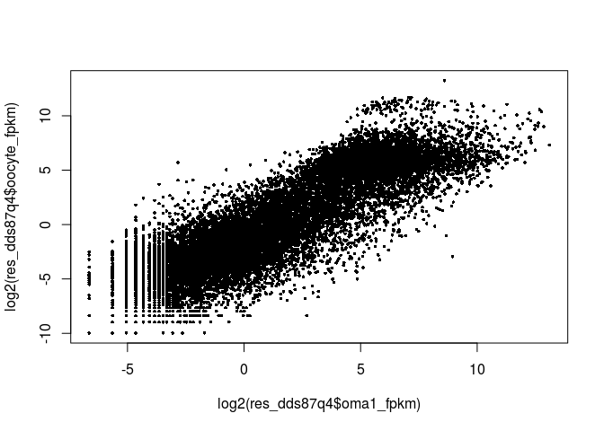<!-- -->

```r
plot(log2(res_dds87q4$oma1_fpkm),res_dds87q4$gonadLog2FoldChange,cex=0.5,pch=16)
abline(h=0,col="red")
```

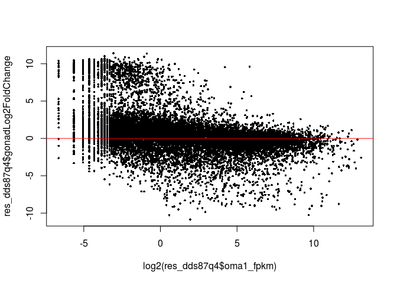<!-- -->

```r
plot(log2(res_dds87q4$lin41_fpkm),log2(res_dds87q4$oocyte_fpkm),cex=0.5,pch=16)
```

<!-- -->

```r
plot(log2(res_dds87q4$lin41_fpkm),res_dds87q4$gonadLog2FoldChange,cex=0.5,pch=16)
abline(h=0,col="red")
```

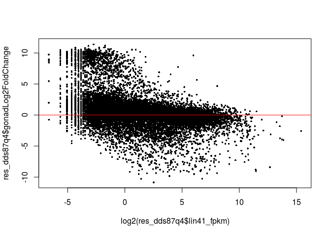<!-- -->

```r
g3<-res_dds87q4 %>%  
  mutate(gonadLog2FoldChange=ifelse(is.na(gonadLog2FoldChange),0,gonadLog2FoldChange)) %>% # set NA's to 0 difference
  ggplot(aes(x=log2(lin41_fpkm),y=`Lin-41 IP`)) +
  ggtitle("Lin-41 Enrichment vs Abundance") + xlab("Log2 (Lin-41 FPKM)") + ylab("Log2 Lin-41 Enrichment in IP")+
  xlim(c(-12,20)) + ylim(c(-10,10)) +
  geom_point(size=0.5,aes(colour = gonadLog2FoldChange)) + 
  scale_colour_gradient2(low = "red2", mid = "white", high = "darkblue") +
  theme_bw()

g4<-res_dds87q4 %>%  
  mutate(gonadLog2FoldChange=ifelse(is.na(gonadLog2FoldChange),0,gonadLog2FoldChange)) %>% # set NA's to 0 difference
  ggplot(aes(x=log2(oma1_fpkm),y=`Oma-1 IP`)) +
  xlim(c(-12,20)) + ylim(c(-10,10)) +
  ggtitle("Oma-1 Enrichment vs Abundance") + xlab("Log2 (Oma-1 FPKM)") + ylab("Log2 Oma-1 Enrichment in IP")+
  geom_point(size=0.5,aes(colour = gonadLog2FoldChange)) + 
  scale_colour_gradient2(low = "red2", mid = "white", high = "darkblue") +
  theme_bw()

#svglite("testplot.svg",width=10,height=8)
grid.arrange(g4,g3,ncol=2)
```

```
## Warning: Removed 22484 rows containing missing values (geom_point).

## Warning: Removed 22484 rows containing missing values (geom_point).
```

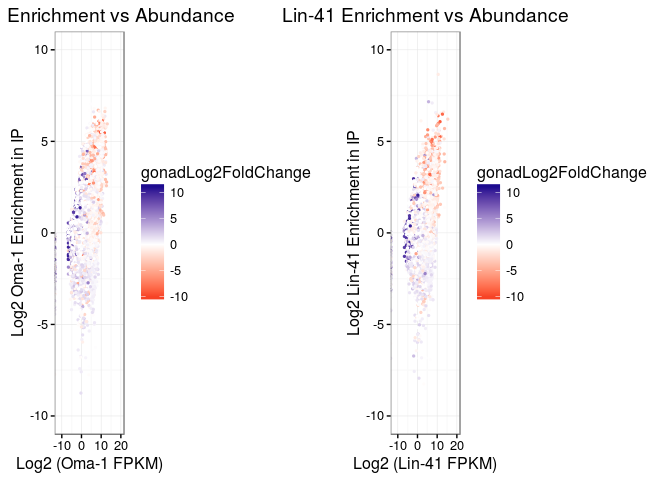<!-- -->

```r
#dev.off()
```

Make a barplot showing the bias for Oocyte specific genes in the IP'd RNPs.  The point here is to determine if the RNPs are loaded in a biased way with transcripts involved in oogenesis.  Spike et al originally showed this by seeing how many oogenic genes were in each "bin" of the transcripts present in the IP.  But very low abundance transcripts that are oocyte enriched may have large enrichments in the RNPs that would be lost by just binning the IP transcripts by abundance.  Probably need to look at it both ways and see if a clear trend is present.

## Barplot to show high Abundance Transcripts are more likely to be Oogenic

```r
#make the barplot
res_dds87q4 %>% 
  dplyr::select(oma1_fpkm,lin41_fpkm,oocyte_fpkm) %>% 
  mutate(oocyte_fpkm=ifelse(is.na(oocyte_fpkm),0.001,oocyte_fpkm)) %>% 
  gather(gene,fpkm,oma1_fpkm,lin41_fpkm) %>% 
  mutate(high_oocyte = ifelse(oocyte_fpkm > 1,"Oogenic","not Oogenic")) %>% 
  mutate(bin=cut(log2(fpkm+0.001),5,labels=c("e","d","c","b","a"))) %>% 
  mutate(bin=factor(bin,levels=c("a","b","c","d","e"))) %>% 
  group_by(gene,bin) %>% 
  ggplot(aes(x=gene,fill=high_oocyte))+
  geom_bar(stat="count") +facet_grid(.~bin) + theme_bw() +
  xlab("High Abundance  ... Low Abundance") +
  ylab("Number of Transcripts, color by Oocyte Expression Level")  +
  theme(axis.text.x = element_text(angle = 90,  hjust = 0)) 
```

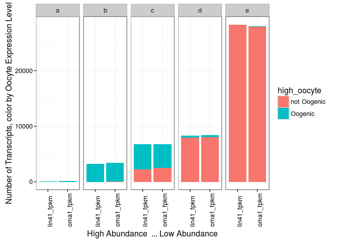<!-- -->

Rethink - these RNPs are clearly going to be loaded with oocyte genes since the expression of the tagged construct is mostly oocyte.   It is really just a control to show that the enriched genes (IP vs lysate) are from the oocytes.


```r
#try a volcano on the kimble data
g5<-res_dds87q4  %>%  
  mutate(oma1_log2FC=ifelse(is.na(`Oma-1 IP`),0,`Oma-1 IP`)) %>% # set NA's to 0 difference
  ggplot(aes(x=gonadLog2FoldChange,y=(-1)*log10(gonadPadj))) +
  ggtitle("Gonad Expression Changes") + xlab("Log2 Gonad Fold Change") + ylab("-log10(gonad p-value)")+
  geom_point(size=0.5,aes(colour = oma1_log2FC)) + 
  scale_colour_gradient2(low = "red2", mid = "white", high = "darkblue") +
  theme_bw()

g6<-res_dds87q4  %>%  
  mutate(lin41_log2FC=ifelse(is.na(`Oma-1 IP`),0,`Lin-41 IP`)) %>% # set NA's to 0 difference
  ggplot(aes(x=gonadLog2FoldChange,y=(-1)*log10(gonadPadj))) +
  ggtitle("Gonad Expression Changes") + xlab("Log2 Gonad Fold Change") + ylab("-log10(gonad p-value)")+
  geom_point(size=0.5,aes(colour = lin41_log2FC)) + 
  scale_colour_gradient2(low = "red2", mid = "white", high = "darkblue") +
  theme_bw()

grid.arrange(g5,g6,ncol=2)
```

```
## Warning: Removed 29068 rows containing missing values (geom_point).

## Warning: Removed 29068 rows containing missing values (geom_point).
```

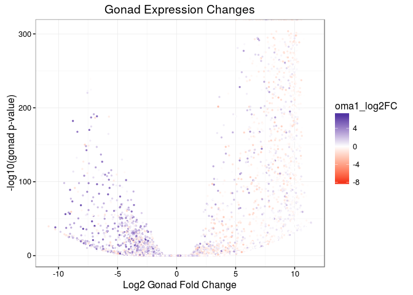<!-- -->


