``` r
library("biomaRt")
library("GenomicFeatures")
library("Rsamtools")

library("GenomicFeatures")
library("Rsamtools")
library("GenomicAlignments")
library("BiocParallel")
library("DESeq2")
library("limma")
library("genefilter")
library("pheatmap")
library("dendsort")
library("SRAdb")
library("goseq")


library("ggplot2")
library("svglite")
library("dplyr")
library("tidyr")
library("magrittr")
library("RColorBrewer")
library("gridExtra")
library("motifStack")
library("VennDiagram")

library("Gviz")
library("BSgenome.Celegans.UCSC.ce11")

seqlevelsStyle(BSgenome.Celegans.UCSC.ce11)<-"Ensembl"
seqlevelsStyle(BSgenome.Celegans.UCSC.ce11)
options(ucscChromosomeNames=FALSE)

(ts<-format(Sys.time(), "%a_%b_%d_%Y_%H%M"))
cbPalette <- c("#999999", "#E69F00", "#56B4E9", "#009E73", "#F0E442", "#0072B2", "#D55E00", "#CC79A7")

cbPalette2<-c("#cbc9e2","#9e9ac8","#6a51a3", "#fdbe85","#fd8d3c","#d94701",
          "#56B4E9", "#009E73","#F0E442", "#0072B2", "black","red","green")

wls<- function(x) { paste0(seqnames(x),":",start(x),"-",end(x))}
```

Download Annotation files for Ensembl 87
----------------------------------------

``` r
ensembl_87 = useMart(biomart="ENSEMBL_MART_ENSEMBL", host="useast.ensembl.org", path="/biomart/martservice",dataset="celegans_gene_ensembl")
txdb<-makeTxDbFromBiomart(biomart="ENSEMBL_MART_ENSEMBL",host="useast.ensembl.org",dataset="celegans_gene_ensembl")

#tx87<-transcriptsBy(txdb, "gene")
ens87<-exonsBy(txdb,by="gene")

#annotations
anno87<-getBM(filters="ensembl_gene_id",values=names(ens87), attributes=c("ensembl_gene_id","wikigene_name","transcript_biotype","external_gene_name"), mart=ensembl_87)

save(ens87,anno87,file="ens87.rdata")
AnnotationDbi::saveDb(txdb,file="~/test.db")
```

Count 2x for Ensembl 87
-----------------------

``` r
load("ens87.rdata")
mapq_filter <- function(features, reads, ignore.strand = FALSE, inter.feature=TRUE)
{
    require(GenomicAlignments) # needed for parallel evaluation
    Union(features, reads[mcols(reads)$mapq >= 4],
          ignore.strand, inter.feature)
}

param <- ScanBamParam(what="mapq")

#select single end bam files that are not filtered by samtools (q4)
(fls <- list.files(".", pattern=glob2rx("*.bam"),full=TRUE))
(fls<-fls[!grepl("q4",fls)])
(fls<-fls[!grepl("PE",fls)])
(fls<-fls[!grepl("IP4_4_23_10.bam",fls)])
bamlst <- BamFileList(fls)

#summarizeOverlaps with multimappers
genehits87<-summarizeOverlaps(ens87,bamlst,mode="Union",singleEnd=TRUE,ignore.strand=TRUE)
apply(assays(genehits87)$counts,2,sum)

#with multimapping Filter
genehits87_mapq_filter<-summarizeOverlaps(ens87,bamlst,mode="mapq_filter", param=param,
                                 singleEnd=TRUE,ignore.strand=TRUE)
apply(assays(genehits87_mapq_filter)$counts,2,sum)

#just check to make sure this is the same as samtools filtering
#(fls <- list.files(".", pattern=glob2rx("*_q4.bam"),full=TRUE))
#bamlst <- BamFileList(fls)
#genehits82q4<-summarizeOverlaps(ens82,bamlst,mode="Union",singleEnd=TRUE,ignore.strand=TRUE)
#apply(assays(genehits82q4)$counts,2,sum)
#all.equal(unname(apply(assays(genehits82_mapq_filter)$counts,2,sum)),unname(apply(assays(genehits82q4)$counts,2,sum)))

save(genehits87,genehits87_mapq_filter,file=paste0("genehits87_",ts,".rdata"))
```

Compare the biotype Distributions across samples with and without a MAPQ filter
-------------------------------------------------------------------------------

``` r
load("ens87.rdata")
load("genehits87_Mon_Feb_06_2017_1446.rdata")

counts87<-as.data.frame(assays(genehits87)$counts)
counts87q4<-as.data.frame(assays(genehits87_mapq_filter)$counts)

                          
summary(idx<-match(rownames(counts87),anno87$ensembl_gene_id))
```

    ##    Min. 1st Qu.  Median    Mean 3rd Qu.    Max. 
    ##       1   12230   24210   24070   35920   47730

``` r
counts87$biotype<-anno87[idx,"transcript_biotype"]
counts87q4$biotype<-anno87[idx,"transcript_biotype"]

mean(apply(counts87[,1:9],2,sum))
```

    ## [1] 40910958

``` r
mean(apply(counts87q4[,1:9],2,sum))
```

    ## [1] 24777575

``` r
g1<-tidyr::gather(counts87,sample,counts,-biotype) %>%
  dplyr::group_by(sample,biotype) %>%
  dplyr::summarize(countSum=sum(counts)) %>%
  ggplot(aes(x=sample,y=countSum,fill=biotype)) + ggtitle("Counts with Ensembl87") +
  scale_fill_manual(values=rev(cbPalette2),guide = guide_legend(reverse=TRUE)) + ylim(c(0,5e7))+
  geom_bar(stat="identity") + theme_classic() + theme(axis.text.x = element_text(angle = 90,  hjust = 0)) 

g2<-tidyr::gather(counts87q4,sample,counts,-biotype) %>%
  dplyr::group_by(sample,biotype) %>%
  dplyr::summarize(countSum=sum(counts)) %>%
  ggplot(aes(x=sample,y=countSum,fill=biotype)) + ggtitle("Counts with Ensembl87 with Mapping Quality Filter") +
  scale_fill_manual(values=rev(cbPalette2),guide = guide_legend(reverse=TRUE)) + ylim(c(0,5e7)) +
  geom_bar(stat="identity") + theme_classic() + theme(axis.text.x = element_text(angle = 90,  hjust = 0)) 

g1
```

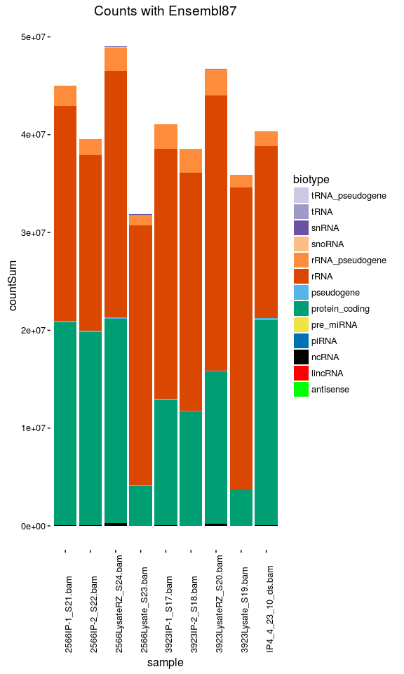

``` r
g2
```

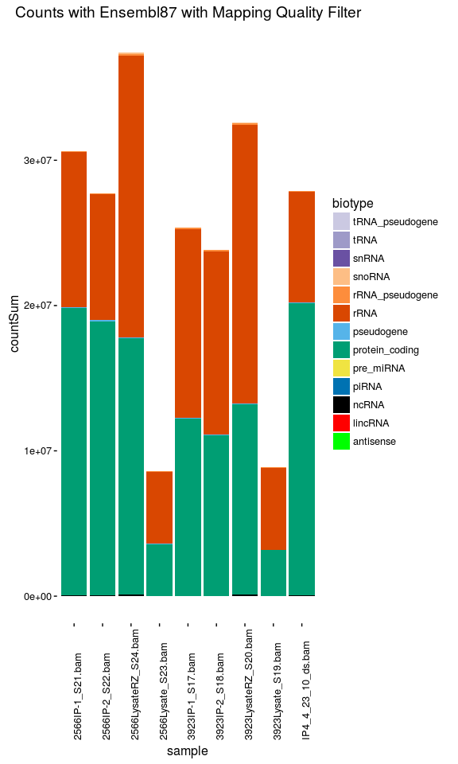

``` r
#grid.arrange(g1,g2,ncol=1)
ggsave(file=paste0("read_distributions_",ts,".svg"),device = svglite::svglite,plot=g1,width=8.5,height=6)
ggsave(file=paste0("read_distributions_q4_",ts,".svg"),device = svglite::svglite,plot=g2,width=8.5,height=6)
```

Filter out rRNA genes and analyze for Enrichment relative to Input
------------------------------------------------------------------

``` r
summary(idx<-match(rownames(genehits87),anno87$ensembl_gene_id))
```

    ##    Min. 1st Qu.  Median    Mean 3rd Qu.    Max. 
    ##       1   12230   24210   24070   35920   47730

``` r
dim(dds87<-DESeqDataSet(genehits87[anno87[idx,]$transcript_biotype != "rRNA",],design=~1))
```

    ## [1] 46717     9

``` r
dim(dds87q4<-DESeqDataSet(genehits87_mapq_filter[anno87[idx,]$transcript_biotype != "rRNA",],design=~1))
```

    ## [1] 46717     9

``` r
file_names<-colnames(dds87)
colnames(dds87)<-sapply(strsplit(colnames(dds87),"_"),function(x) x[1]) %>%
  gsub("2566","OMA-1_",.) %>% gsub("3923","LIN-41_",.) %>% gsub("IP4","OMA-1_042310",.)
dds87$filename<-file_names

file_names<-colnames(dds87q4)
colnames(dds87q4)<-sapply(strsplit(colnames(dds87q4),"_"),function(x) x[1]) %>%
  gsub("2566","OMA-1_",.) %>% gsub("3923","LIN-41_",.) %>% gsub("IP4","OMA-1_042310",.)
dds87q4$filename<-file_names

dds87$tag<-as.factor(c("OMA-1","OMA-1","LysRZ","Lys","LIN-41","LIN-41","LysRZ","Lys","OMA-1_042310"))
dds87q4$tag<-as.factor(c("OMA-1","OMA-1","LysRZ","Lys","LIN-41","LIN-41","LysRZ","Lys","OMA-1_042310"))

design(dds87)<-(~tag)
design(dds87q4)<-(~tag)

(pca1<-plotPCA( DESeqTransform( dds87 ),intgroup="tag")+ ggtitle("PCA without MapQ Filter") +
    scale_color_manual(values=cbPalette[c(7,5,2,6,3)]) +
    theme_bw() + theme(panel.grid.major=element_blank(), panel.grid.minor=element_blank()) )
```

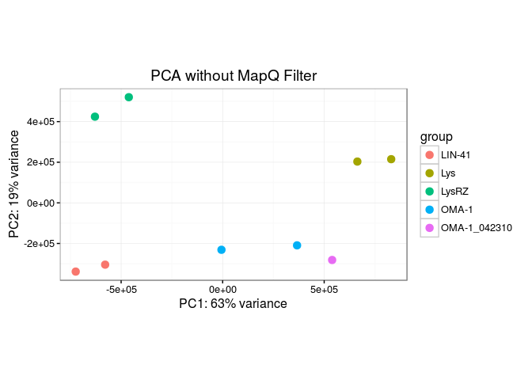

``` r
(pca2<-plotPCA( DESeqTransform( dds87q4 ),intgroup="tag")+ ggtitle("PCA with MapQ Filter") + 
    scale_color_manual(values=cbPalette[c(7,5,2,6,3)]) +
    theme_bw() + theme(panel.grid.major=element_blank(), panel.grid.minor=element_blank()) )
```

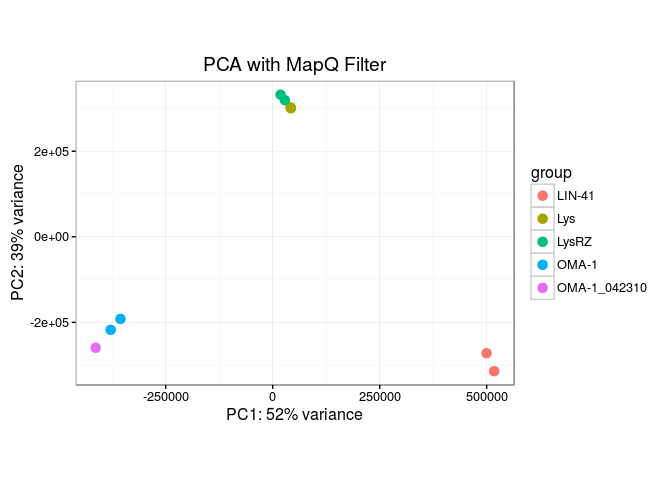

``` r
ggsave(file=paste0("pca_",ts,".svg"),device = svglite::svglite,plot=pca2,width=8.5,height=6)
```

Create bigWig files using DESeq2 normalization Size Factors
-----------------------------------------------------------

``` r
bam2bw<-function(x) {
for (i in seq_along(1:ncol(x))) {
print(colData(x)[i,"filename"])
temp.cov<-coverage(readGAlignments(colData(x)[i,"filename"],param=param),weight=1/colData(x)[i,"sizeFactor"])
export(temp.cov,paste0(colnames(x)[i],"_q4_scaled.bigWig"))
    }
}
bam2bw(dds87q4)
```

Run Differential Expression on both dds objects
-----------------------------------------------

``` r
dds87<-DESeq(dds87)
```

    ## estimating size factors

    ## estimating dispersions

    ## gene-wise dispersion estimates

    ## mean-dispersion relationship

    ## final dispersion estimates

    ## fitting model and testing

``` r
#plotMA(dds87,ylim=c(-8,8))
resultsNames(dds87)
```

    ## [1] "Intercept"       "tagLIN.41"       "tagLys"          "tagLysRZ"       
    ## [5] "tagOMA.1"        "tagOMA.1_042310"

``` r
res_Oma1_dds87<-results(dds87,altHypothesis = "greater",lfcThreshold=0,contrast=c("tag","OMA-1","LysRZ"))
res_Lin41_dds87<-results(dds87,altHypothesis = "greater",lfcThreshold=0,contrast=c("tag","LIN-41","LysRZ"))

#Estimate LogFC for single replicate Oma-1 sample
dds87_counts<-counts(dds87,normalized=TRUE)
res_oma1_042310_dds87<-log2(dds87_counts[,9]+1)-0.5*log2(dds87_counts[,3]+1)-0.5*log2(dds87_counts[,7]+1)

res_dds87<-cbind(res_oma1_042310_dds87,res_Oma1_dds87$log2FoldChange,res_Lin41_dds87$log2FoldChange)
colnames(res_dds87)<-c("Oma-1 042310","Oma-1 IP","Lin-41 IP")

dds87q4<-DESeq(dds87q4)
```

    ## estimating size factors

    ## estimating dispersions

    ## gene-wise dispersion estimates

    ## mean-dispersion relationship

    ## final dispersion estimates

    ## fitting model and testing

``` r
#plotMA(dds87q4,ylim=c(-8,8))
resultsNames(dds87q4)
```

    ## [1] "Intercept"       "tagLIN.41"       "tagLys"          "tagLysRZ"       
    ## [5] "tagOMA.1"        "tagOMA.1_042310"

``` r
res_Oma1_dds87q4<-results(dds87q4,altHypothesis = "greater",lfcThreshold=0,contrast=c("tag","OMA-1","LysRZ"))
res_Lin41_dds87q4<-results(dds87q4,altHypothesis = "greater",lfcThreshold=0,contrast=c("tag","LIN-41","LysRZ"))

#Estimate LogFC for single replicate Oma-1 sample
dds87q4_counts<-counts(dds87q4,normalized=TRUE)
res_oma1_042310_dds87q4<-log2(dds87q4_counts[,9]+1)-0.5*log2(dds87q4_counts[,3]+1)-0.5*log2(dds87q4_counts[,7]+1)

res_dds87q4<-as.data.frame(cbind(res_oma1_042310_dds87q4,res_Oma1_dds87q4$log2FoldChange,res_Lin41_dds87q4$log2FoldChange))
colnames(res_dds87q4)<-c("Oma-1 042310","Oma-1 IP","Lin-41 IP")
```

Quick look at enrichment in old vs new data
-------------------------------------------

``` r
idx<-!(is.na(res_dds87q4[,2]) | is.na(res_dds87q4[,3]))
corr_oma_v_lin<-cor(res_dds87q4[idx,2],res_dds87q4[idx,3],method="spearman")
corr_oma_v_oma<-cor(res_dds87q4[idx,2],res_dds87q4[idx,1],method="spearman")

plot(res_dds87q4[,2],res_dds87q4[,3],cex=0.5,pch=16,xlab="Oma-1",ylab="Lin-41",
     main="Enrichment Relative to Ribozero Lysate")
text(-6,5,paste0("Spearman correlation:  ",round(corr_oma_v_lin,3)),col="blue")
```

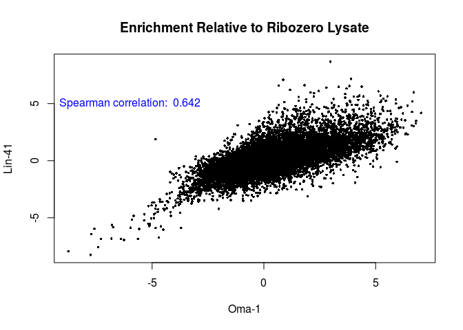

``` r
plot(res_dds87q4[,2],res_dds87q4[,1],cex=0.5,pch=16,xlab="Oma-1",ylab="Oma-1 042310",
     main="Enrichment Relative to Ribozero Lysate")
text(-6,5,paste0("Spearman correlation:  ",round(corr_oma_v_oma,3)),col="blue")
```

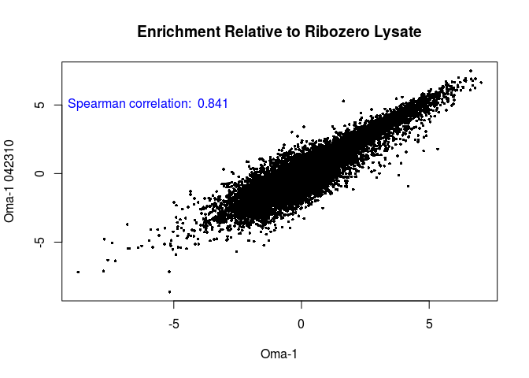

MAKE A Master Table with MAPQ FLAG, Biotype, and mean FPKM per sample
---------------------------------------------------------------------

``` r
#add basemean and p-values
idx<-match(rownames(res_dds87q4),rownames(res_Oma1_dds87q4))
res_dds87q4$baseMean<-res_Oma1_dds87q4$baseMean
res_dds87q4$Oma1_padj<-res_Oma1_dds87q4$padj
res_dds87q4$Lin41_padj<-res_Lin41_dds87q4$padj
  
#Add annotation information
idx<-match(rownames(res_dds87q4),anno87$ensembl_gene_id)
res_dds87q4$biotype<-anno87[idx,"transcript_biotype"]
res_dds87q4$name<-anno87[idx,"wikigene_name"]
res_dds87q4$external_name<-anno87[idx,"external_gene_name"]


lfc<-2  # also note not using abs() here -- just want enrichment
p<-0.05
length(oma1_genes<-rownames(subset(res_Oma1_dds87,log2FoldChange > lfc & padj < p)))
```

    ## [1] 2345

``` r
length(oma1q4_genes<-rownames(subset(res_Oma1_dds87q4,log2FoldChange > lfc & padj < p)))
```

    ## [1] 2259

``` r
length(lin41_genes<-rownames(subset(res_Lin41_dds87,log2FoldChange > lfc & padj < p)))
```

    ## [1] 1157

``` r
length(lin41q4_genes<-rownames(subset(res_Lin41_dds87q4,log2FoldChange > lfc & padj < p)))
```

    ## [1] 1115

``` r
#Find genes with different result due to MAPQ filter

length(mapq_effected_genes<-setdiff(sort(unique(c(oma1_genes,lin41_genes))),sort(unique(c(oma1q4_genes,lin41q4_genes)))))
```

    ## [1] 111

``` r
res_dds87q4$mapq_effect <- rownames(res_dds87q4) %in% mapq_effected_genes

#Add FPKMs
dds87q4_fpkm<-as.data.frame(fpkm(dds87q4))
(lysRZ_columns<-which(colData(dds87q4)[colnames(dds87q4),"tag"]=="LysRZ"))
```

    ## [1] 3 7

``` r
(oma1_columns<-which(colData(dds87q4)[colnames(dds87q4),"tag"]=="OMA-1"))
```

    ## [1] 1 2

``` r
(lin41_columns<-which(colData(dds87q4)[colnames(dds87q4),"tag"]=="LIN-41"))
```

    ## [1] 5 6

``` r
dds87q4_fpkm$lysRZ<-apply(dds87q4_fpkm,1,function(x) mean(x[lysRZ_columns]))
dds87q4_fpkm$oma1<-apply(dds87q4_fpkm,1,function(x) mean(x[oma1_columns]))
dds87q4_fpkm$lin41<-apply(dds87q4_fpkm,1,function(x) mean(x[lin41_columns]))

idx<-match(rownames(res_dds87q4),rownames(dds87q4_fpkm))
res_dds87q4$oma1_042310_fpkm<-round(dds87q4_fpkm[idx,"OMA-1_042310"],2)
res_dds87q4$lysRZ_fpkm<-round(dds87q4_fpkm[idx,"lysRZ"],2)
res_dds87q4$oma1_fpkm<-round(dds87q4_fpkm[idx,"oma1"],2)
res_dds87q4$lin41_fpkm<-round(dds87q4_fpkm[idx,"lin41"],2)
```

Venn Diagrams - with p-values
=============================

``` r
x1<-length(oma1_genes)
y1<-length(lin41_genes)
z1<-sum(oma1_genes %in% lin41_genes)
grid.newpage()
vennplot <- draw.pairwise.venn(x1,y1,z1, c("Oma-1", "Lin-41"))
```


``` r
x2<-length(oma1q4_genes)
y2<-length(lin41q4_genes)
z2<-length(overlapq4<-oma1q4_genes[oma1q4_genes %in% lin41q4_genes])
x21<-length(oma1q4_genes_exclusive<-oma1q4_genes[!oma1q4_genes %in% overlapq4])
y21<-length(lin41q4_genes_exclusive<-lin41q4_genes[!lin41q4_genes %in% overlapq4])
grid.newpage()
vennplot <- draw.pairwise.venn(x2,y2,z2, c("Oma-1", "Lin-41"))
```

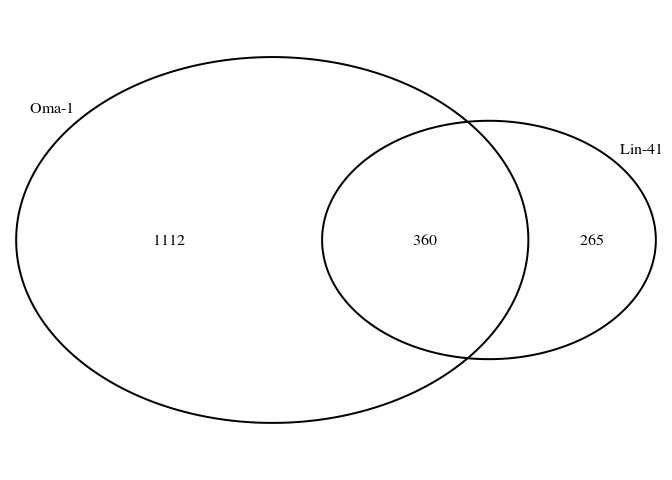

``` r
svglite::svglite(file=paste0("venn_",ts,".svg"),width=8,height=8)
vennplot <- draw.pairwise.venn(x2,y2,z2, c("Oma-1", "Lin-41"))
dev.off()
```

    ## png 
    ##   2

Use scatterplot to visualize relationships in Venn Diagram
----------------------------------------------------------

``` r
#plot(res_dds87q4[,2],res_dds87q4[,3],cex=0.5,pch=16,ylim=c(-7,7),xlim=c(-7,7),main="Oma-1 vs Lin-41 Enrichment", 
#     ylab="LIN-41 Log2Fold Change",xlab="OMA-1 Log2Fold Change",
#     col=ifelse(rownames(res_dds87q4) %in% overlapq4,cbPalette[8],
#                ifelse(rownames(res_dds87q4) %in% oma1q4_genes_exclusive,cbPalette[6],
#                ifelse(rownames(res_dds87q4) %in% lin41q4_genes_exclusive,cbPalette[7],cbPalette[1]))))
#abline(a=0,b=1,col="black")
#abline(h=2,col=cbPalette[1])
#abline(v=2,col=cbPalette[1])

s<-res_dds87q4[,c("Oma-1 IP","Lin-41 IP","external_name")] %>% 
  tibble::rownames_to_column() %>% 
  dplyr::filter(!is.na(`Oma-1 IP`) | !is.na(`Lin-41 IP`)) %>% 
  mutate(group=ifelse(rowname %in% overlapq4,"overlap",
                ifelse(rowname %in% oma1q4_genes_exclusive,"oma-1",
                ifelse(rowname %in% lin41q4_genes_exclusive,"lin-41","none"))))  %>% 
  ggplot(aes(x=`Oma-1 IP`,y=`Lin-41 IP`,color=group)) +geom_point() +
  scale_color_manual(values=cbPalette[c(7,1,6,8)]) +
  xlim(c(-9,9)) + ylim(c(-9,9)) + 
  geom_abline() + geom_hline(yintercept = 2,color="gray") + geom_vline(xintercept = 2,color="gray") +
  ylab("LIN-41 Log2Fold Change") + xlab ("OMA-1 Log2Fold Change") +
  ggtitle("Oma-1 vs Lin-41 Enrichment")+
  theme_bw() + theme(panel.grid.major=element_blank(), panel.grid.minor=element_blank())

labels<-res_dds87q4[res_dds87q4$external_name %in% c("spn-4","cdc-25.3","lin-29","zif-1","rnp-1"),
                    c("Oma-1 IP","Lin-41 IP","external_name")]

s<-s+annotate("text",x=labels$`Oma-1 IP`, y=labels$`Lin-41 IP`,label=labels$external_name)

s
```

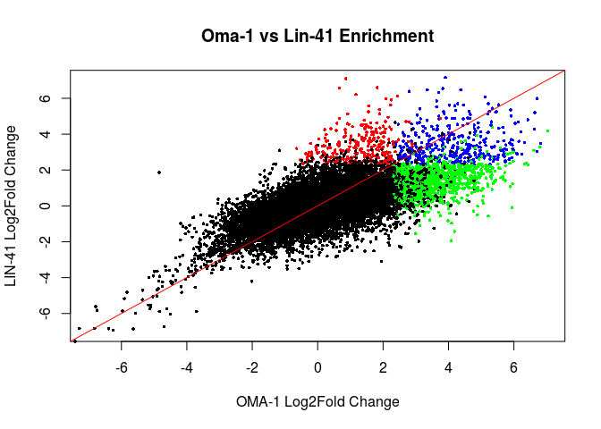

``` r
pdf(paste0("scatter_",ts,".pdf"),width=8,height=8)
s
dev.off()
```

    ## png 
    ##   2

``` r
ggsave(file=paste0("scatter_",ts,".svg"),device = svglite::svglite,plot=s,width=8,height=8)
```

Visualise as smoothScatter
--------------------------

``` r
Lab.palette <- colorRampPalette(c("white", "orange", "red"), space = "Lab")

#jpeg("oma1_vs_lin41_scatter.jpg",width=600,height=600,type="cairo")
#svglite("testplot.svg",width=8,height=8)
i.s<-smoothScatter(res_dds87q4$`Oma-1 IP`,res_dds87q4$`Lin-41 IP`, colramp = Lab.palette,
                     ## pch=NA: do not draw them
                     xlab=("Log2 Oma-1 Enrichment"),
                     ylab=("Log2 Lin-41 Enrichment"),
                     nrpoints = 100, ret.selection=TRUE,main="Relative Enrichment in IP's")
#identify(temp$Oma.1.IP,temp$Lin.41.IP, labels=temp$Gene.Name)
gene_list<-c("spn-4","cdc-25.3","lin-29","zif-1","rnp-1")
for ( g in gene_list ){
  x<-res_dds87q4[grep(g,res_dds87q4$'name'),'Oma-1 IP']
  y<-res_dds87q4[grep(g,res_dds87q4$'name'),'Lin-41 IP']
  print(x)
  print(y)
  print(g)
  text(x,y,g)
  }
```

    ## [1] 1.171641
    ## [1] 6.214094
    ## [1] "spn-4"
    ## [1] 5.125417
    ## [1] 6.076521
    ## [1] "cdc-25.3"
    ## [1] 0.8602293
    ## [1] 7.09693
    ## [1] "lin-29"
    ## [1] 5.251027
    ## [1] 5.272734
    ## [1] "zif-1"
    ## [1] 5.959066
    ## [1] 3.193639
    ## [1] "rnp-1"

``` r
abline(h=2,col="red")
abline(v=2,col="red")
```

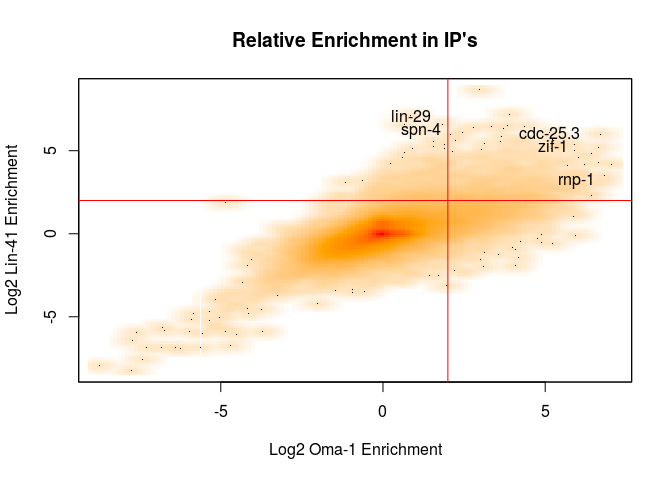

Heatmaps of High Log2FC or High Variance Genes
----------------------------------------------

``` r
#pull out a copy of the data without NA values
dim(temp<-res_dds87q4[!(is.na(res_dds87q4[,2]) | is.na(res_dds87q4[,3])),])
```

    ## [1] 24233    14

``` r
#Add classification for Annotation row
table(temp$class<-ifelse(rownames(temp) %in% overlapq4,"Overlap",
                ifelse(rownames(temp) %in% oma1q4_genes_exclusive,"OMA-1 IP Enriched",
                ifelse(rownames(temp) %in% lin41q4_genes_exclusive,"LIN-41 IP Enriched","Not Enriched"))))
```

    ## 
    ## LIN-41 IP Enriched       Not Enriched  OMA-1 IP Enriched 
    ##                409              21565               1553 
    ##            Overlap 
    ##                706

``` r
#compute variance between LIN-41 and OMA-1 IP
temp$rowvar<-round(rowVars(temp[,2:3]),3)

#subset out components of Venn Diagram
dim(temp<-temp[temp$class != "Not Enriched",])
```

    ## [1] 2668   16

``` r
#subset to genes that are abundant in one or both IPs
dim(temp<-temp[temp$oma1_fpkm > 50 | temp$lin41_fpkm > 50,])
```

    ## [1] 1717   16

``` r
#check table
goi<-c("lin-29","spn-4","lin-66","mab-10","orc-1","dmd-3","meg-1","dlk-1","mex-3")
knitr::kable(temp[temp$external_name %in% goi,c(2,3,9,12:16)])
```

|                |    Oma-1 IP|  Lin-41 IP| external\_name |  lysRZ\_fpkm|  oma1\_fpkm|  lin41\_fpkm| class              |  rowvar|
|----------------|-----------:|----------:|:---------------|------------:|-----------:|------------:|:-------------------|-------:|
| WBGene00001008 |  -0.2195739|   3.491174| dlk-1          |        11.34|        9.72|       128.12| LIN-41 IP Enriched |   6.885|
| WBGene00001562 |   1.2472054|   2.316442| lin-66         |        16.39|       38.96|        81.83| LIN-41 IP Enriched |   0.572|
| WBGene00003015 |   0.8602293|   7.096931| lin-29         |         1.28|        2.30|       176.43| LIN-41 IP Enriched |  19.448|
| WBGene00003107 |   2.9743882|   8.658780| mab-10         |         3.64|       28.69|      1483.46| Overlap            |  16.156|
| WBGene00003229 |   1.4099740|   2.966692| mex-3          |       224.20|      596.48|      1756.82| LIN-41 IP Enriched |   1.212|
| WBGene00004984 |   1.1716409|   6.214094| spn-4          |       578.99|     1305.56|     43194.44| LIN-41 IP Enriched |  12.713|
| WBGene00010492 |   0.4013703|   4.304758| meg-1          |        88.14|      116.44|      1747.34| LIN-41 IP Enriched |   7.618|
| WBGene00012650 |   1.8200263|   6.601930| orc-1          |       100.50|      355.46|      9817.11| LIN-41 IP Enriched |  11.433|

``` r
#Select top 40 genes
temp<- temp %>% tibble::rownames_to_column(var="ensembl") %>% 
  top_n(40,rowvar)

#sort based on lin41 abundance
temp<-temp[with(temp,order(-`lin41_fpkm`)),]

ann_colors = list(
class = c('OMA-1 IP Enriched' = cbPalette[6],
          'LIN-41 IP Enriched' = cbPalette[7],
          'Overlap' = cbPalette[8])
)

ann_row = temp[,"class",drop=F]
rownames(ann_row)<-temp$ensembl

pheatmap(log2(dds87q4_fpkm[temp$ensembl,c(3,7,9,1,2,5,6)]),cluster_cols=F,cluster_rows=F,
         labels_row=temp$external_name,clustering_callback=callback, 
         main="",
         annotation_row =ann_row,legend=TRUE,
         legend_breaks = c(0, 5, 10, 15, log2(max(temp[,"lin41_fpkm"]))),
         legend_labels = c("0", "5", "10", "15", "Log2 FPKM\n"),
         annotation_colors=ann_colors)
```

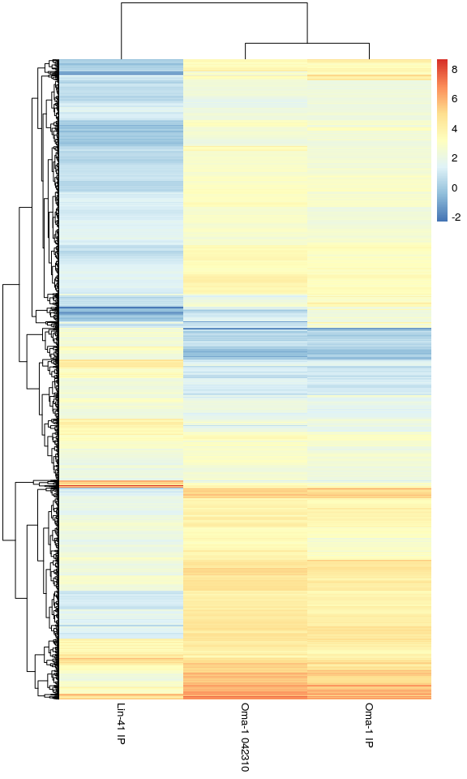

``` r
pheatmap(log2(dds87q4_fpkm[temp$ensembl,c(3,7,9,1,2,5,6)]),cluster_cols=F,cluster_rows=F,
         labels_row=temp$external_name,clustering_callback=callback, 
         main="",
         filename=paste0("heatmap_",ts,".pdf"),
         annotation_row =ann_row,legend=TRUE,
         legend_breaks = c(0, 5, 10, 15, log2(max(temp[,"lin41_fpkm"]))),
         legend_labels = c("0", "5", "10", "15", "Log2 FPKM\n"),
         annotation_colors=ann_colors)
```

Now run GO Analysis on each section of Venn Diagram
===================================================

GO Analysis
-----------

``` r
downloader::download("ftp://ftp.wormbase.org/pub/wormbase/releases/WS257/ONTOLOGY/gene_association.WS257.wb",
                     "gene_association.WS257.wb")
downloader::download("ftp://ftp.wormbase.org/pub/wormbase/releases/WS257/ONTOLOGY/gene_ontology.WS257.obo",
                     "gene_ontology.WS257.obo")

ga<-readr::read_delim("gene_association.WS257.wb",skip=3,delim="\t",col_names=F)

#Scan in OBO file to get Biological Process terms
t1<-readLines("gene_ontology.WS257.obo",n=-1L)
terms<-list()

for (i in seq_along(1:length(t1))) {
  if (t1[i]=="[Term]") {
    gt<-substr(t1[i+1],5,14)
    name<-gsub("name: ","",t1[i+2])
    if (t1[i+3]=="namespace: biological_process") { 
      #print (paste0(gt,":  ",name)) 
      terms[[gt]]<-name
    }
    }
}
go_terms<-unlist(terms)

head(ga)
wb_go<-ga[ga$'X5' %in% names(go_terms),c('X2','X5')]
colnames(wb_go)<-c("ensembl","GO ID")
dim(wb_go<-as.data.frame(wb_go))
#remove duplicated entries (possibly from multiple lines of evidence)
dim(wb_go<-wb_go[!duplicated(wb_go),])

wb_go.list<-split(wb_go$`GO ID`,wb_go$ensembl)

#List Terms for a gene
anno87[grep("lin-41",anno87$wikigene_name),]
go_terms[wb_go.list[["WBGene00003026"]]]

anno87[grep("lin-29",anno87$wikigene_name),]
go_terms[wb_go.list[["WBGene00003015"]]]

#List Genes for a Term
anno87[anno87$ensembl_gene_id %in% wb_go[grep("GO:0045138",wb_go$`GO ID`),"ensembl"],]

save(wb_go,go_terms,file="wb_257_goterms.rdata")
```

GO Analysis of each VENN category
---------------------------------

``` r
load("wb_257_goterms.rdata")
length(expressed_genes<-rownames(res_dds87q4[res_dds87q4$baseMean > 1,]))
```

    ## [1] 16031

``` r
#alternatively insist on enough data to define p-value
#length(expressed_genes<-rownames(res_Lin41_dds87q4[res_Lin41_dds87q4$baseMean > 1 & !is.na(res_Lin41_dds87q4$log2FoldChange) & !is.na(res_Lin41_dds87q4$padj) & !is.na(res_Oma1_dds87q4$log2FoldChange) & !is.na(res_Oma1_dds87q4$padj),]))

dim(wb_go<-wb_go[wb_go$ensembl %in% expressed_genes,])
```

    ## [1] 42014     2

``` r
wb_go.list<-split(wb_go$`GO ID`,wb_go$ensembl)

listGO<-function(goid,degs) {
  #print(go_terms[goid])
  tg<-wb_go[grep(goid,wb_go$`GO ID`),"ensembl",drop=F]
  tg$go<-goid
  idx<-match(tg$ensembl,anno87$ensembl_gene_id)
  tg$symbol<-anno87[idx,"wikigene_name"]
  tg$deg<-degs[tg$ensembl]
  tg$`OMA-1 IP`<-res_dds87q4[tg$ensembl,"Oma-1 IP"]
  tg$`LIN-41 IP`<-res_dds87q4[tg$ensembl,"Lin-41 IP"]
  as.data.frame(tg[tg$deg==1,])
}

#degs_temp<-rep(NA,length(expressed_genes))
#names(degs_temp)<-expressed_genes
#listGO("GO:0045138",degs_temp)

#bias data
bd<-sum(width(reduce(ens87)))
bd<-bd[names(bd) %in% expressed_genes]

#GOseq - Lin41 exclusive
table(degs_lin41<-as.numeric(expressed_genes %in% lin41q4_genes_exclusive ))
```

    ## 
    ##     0     1 
    ## 15622   409

``` r
names(degs_lin41)<-expressed_genes
lin41_GO<-goseq(nullp(degs_lin41,bias.data=bd),gene2cat=wb_go.list)
```

    ## Warning in pcls(G): initial point very close to some inequality constraints

    ## Using manually entered categories.

    ## For 6821 genes, we could not find any categories. These genes will be excluded.

    ## To force their use, please run with use_genes_without_cat=TRUE (see documentation).

    ## This was the default behavior for version 1.15.1 and earlier.

    ## Calculating the p-values...

    ## 'select()' returned 1:1 mapping between keys and columns

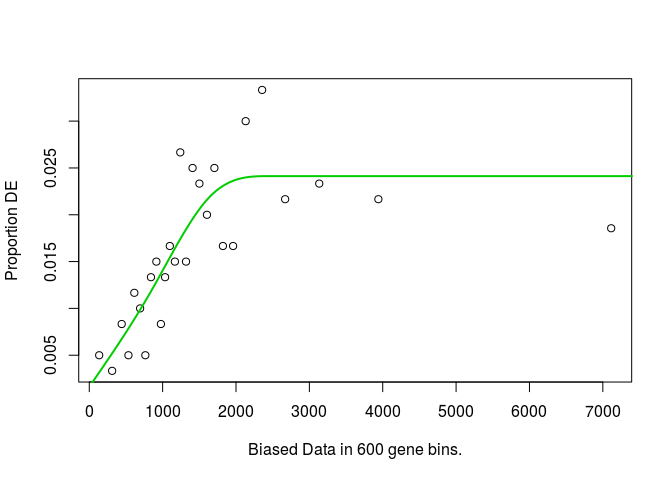

``` r
lin41_GO[1:10,c("category","term","numDEInCat","numInCat","over_represented_pvalue")]
```

    ##        category
    ## 3002 GO:1903864
    ## 657  GO:0007049
    ## 1819 GO:0040027
    ## 45   GO:0000281
    ## 666  GO:0007067
    ## 957  GO:0009792
    ## 752  GO:0007276
    ## 1538 GO:0032436
    ## 2218 GO:0046777
    ## 2915 GO:1901642
    ##                                                                                  term
    ## 3002                                                            P granule disassembly
    ## 657                                                                        cell cycle
    ## 1819                                        negative regulation of vulval development
    ## 45                                                                mitotic cytokinesis
    ## 666                                                          mitotic nuclear division
    ## 957                                embryo development ending in birth or egg hatching
    ## 752                                                                 gamete generation
    ## 1538 positive regulation of proteasomal ubiquitin-dependent protein catabolic process
    ## 2218                                                      protein autophosphorylation
    ## 2915                                               nucleoside transmembrane transport
    ##      numDEInCat numInCat over_represented_pvalue
    ## 3002          3        3            4.251081e-05
    ## 657          14      143            1.340555e-04
    ## 1819         16      209            6.224856e-04
    ## 45            5       24            6.586855e-04
    ## 666          11      111            7.447675e-04
    ## 957         108     2901            8.076946e-04
    ## 752          10      102            9.158284e-04
    ## 1538          4       16            1.364242e-03
    ## 2218          4       16            1.702355e-03
    ## 2915          3        8            1.719424e-03

``` r
listGO("GO:1903864",degs_lin41)
```

    ##              ensembl         go symbol deg  OMA-1 IP LIN-41 IP
    ## 20516 WBGene00003150 GO:1903864  mbk-2   1 1.4407600  3.747531
    ## 49111 WBGene00010492 GO:1903864  meg-1   1 0.4013703  4.304758
    ## 49124 WBGene00010493 GO:1903864  meg-2   1 0.5345244  3.114458

``` r
#GOseq - Oma1 exclusive
table(degs_oma1<-as.numeric(expressed_genes %in% oma1q4_genes_exclusive ))
```

    ## 
    ##     0     1 
    ## 14478  1553

``` r
names(degs_oma1)<-expressed_genes
oma1_GO<-goseq(nullp(degs_oma1,bias.data=bd),gene2cat=wb_go.list)
```

    ## Warning in pcls(G): initial point very close to some inequality constraints

    ## Using manually entered categories.

    ## For 6821 genes, we could not find any categories. These genes will be excluded.

    ## To force their use, please run with use_genes_without_cat=TRUE (see documentation).

    ## This was the default behavior for version 1.15.1 and earlier.

    ## Calculating the p-values...

    ## 'select()' returned 1:1 mapping between keys and columns

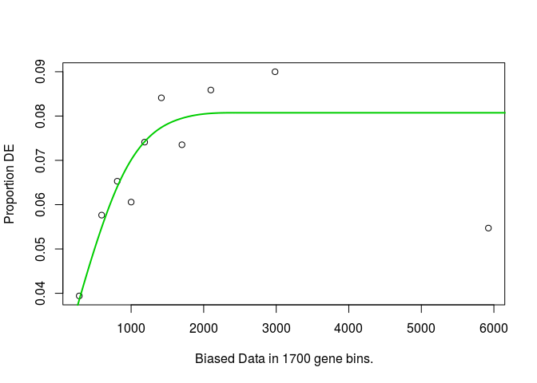

``` r
oma1_GO[1:10,c("category","term","numDEInCat","numInCat","over_represented_pvalue")]
```

    ##        category
    ## 494  GO:0006616
    ## 734  GO:0007219
    ## 160  GO:0002064
    ## 874  GO:0008654
    ## 1701 GO:0034975
    ## 382  GO:0006417
    ## 1863 GO:0042335
    ## 2603 GO:0061158
    ## 816  GO:0008033
    ## 1136 GO:0016024
    ##                                                                            term
    ## 494  SRP-dependent cotranslational protein targeting to membrane, translocation
    ## 734                                                     Notch signaling pathway
    ## 160                                                 epithelial cell development
    ## 874                                           phospholipid biosynthetic process
    ## 1701                                   protein folding in endoplasmic reticulum
    ## 382                                                   regulation of translation
    ## 1863                                                        cuticle development
    ## 2603                                       3'-UTR-mediated mRNA destabilization
    ## 816                                                             tRNA processing
    ## 1136                                    CDP-diacylglycerol biosynthetic process
    ##      numDEInCat numInCat over_represented_pvalue
    ## 494           4        4            0.0000803121
    ## 734           8       16            0.0000898372
    ## 160           9       22            0.0002454696
    ## 874           9       23            0.0003734255
    ## 1701          4        5            0.0005041599
    ## 382          10       30            0.0007960791
    ## 1863          7       17            0.0012431228
    ## 2603          7       18            0.0013841812
    ## 816          11       38            0.0014604270
    ## 1136          4        6            0.0016381919

``` r
listGO("GO:0007219",degs_oma1)
```

    ##              ensembl         go  symbol deg OMA-1 IP LIN-41 IP
    ## 1202  WBGene00000147 GO:0007219   aph-1   1 2.489680 1.6504889
    ## 12552 WBGene00001609 GO:0007219   glp-1   1 3.021270 0.9819341
    ## 14978 WBGene00001965 GO:0007219  hlh-26   1 3.318161 2.0397383
    ## 17334 WBGene00002245 GO:0007219   lag-1   1 4.029638 1.1819689
    ## 18865 WBGene00003001 GO:0007219  lin-12   1 2.370937 0.8276394
    ## 31403 WBGene00004769 GO:0007219  sel-12   1 3.648529 1.9753697
    ## 50632 WBGene00011195 GO:0007219   sao-1   1 2.571896 1.9713531
    ## 58728 WBGene00015793 GO:0007219 C15C7.7   1 2.858020 1.4645225

``` r
#GOseq - overlap
table(degs_overlap<-as.numeric(expressed_genes %in% overlapq4 ))
```

    ## 
    ##     0     1 
    ## 15325   706

``` r
names(degs_overlap)<-expressed_genes
overlap_GO<-goseq(nullp(degs_overlap,bias.data=bd),gene2cat=wb_go.list)
```

    ## Using manually entered categories.

    ## For 6821 genes, we could not find any categories. These genes will be excluded.

    ## To force their use, please run with use_genes_without_cat=TRUE (see documentation).

    ## This was the default behavior for version 1.15.1 and earlier.

    ## Calculating the p-values...

    ## 'select()' returned 1:1 mapping between keys and columns


``` r
overlap_GO[1:10,c("category","term","numDEInCat","numInCat","over_represented_pvalue")]
```

    ##        category                                                 term
    ## 788  GO:0007548                                  sex differentiation
    ## 1071 GO:0014018                        neuroblast fate specification
    ## 345  GO:0006355           regulation of transcription, DNA-templated
    ## 1365 GO:0030154                                 cell differentiation
    ## 1188 GO:0016540                               protein autoprocessing
    ## 2066 GO:0045132                       meiotic chromosome segregation
    ## 962  GO:0009887                                  organ morphogenesis
    ## 786  GO:0007530                                    sex determination
    ## 1255 GO:0019099                   female germ-line sex determination
    ## 2079 GO:0045199 maintenance of epithelial cell apical/basal polarity
    ##      numDEInCat numInCat over_represented_pvalue
    ## 788           8       24            4.292173e-06
    ## 1071          3        4            3.783241e-04
    ## 345          45      605            6.577555e-04
    ## 1365         16      150            7.256375e-04
    ## 1188          3        5            7.961026e-04
    ## 2066         14      126            1.098516e-03
    ## 962           4       11            1.139188e-03
    ## 786           3        6            1.157607e-03
    ## 1255          2        2            1.381117e-03
    ## 2079          2        2            1.822637e-03

``` r
#horizontal bar plots
head(overlap_GO,10) %>% select(term) %>% knitr::kable(row.names = FALSE)
```

term
----

sex differentiation
neuroblast fate specification
regulation of transcription, DNA-templated
cell differentiation
protein autoprocessing
meiotic chromosome segregation
organ morphogenesis
sex determination
female germ-line sex determination
maintenance of epithelial cell apical/basal polarity

``` r
g7<-head(overlap_GO,10) %>%
  dplyr::mutate(cat=factor(category,levels=rev(category))) %>%
  ggplot(aes(x=cat,y=-log10(over_represented_pvalue))) +
  geom_bar(stat="identity",fill=cbPalette[8]) + ylim(c(0,5.5)) +
  coord_flip() + xlab("") + ggtitle("Enriched GO terms overlapped Set") +
  theme_bw() + theme(panel.grid.major=element_blank(), panel.grid.minor=element_blank(),aspect.ratio=4/3)

g7
```

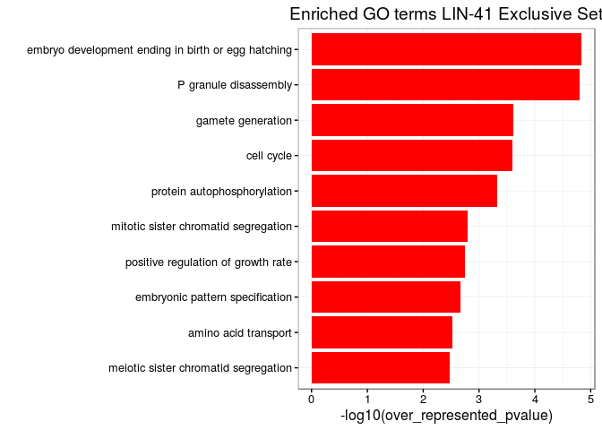

``` r
pdf(paste0("GO_Overlap_",ts,".pdf"),width=3,height=3); g7; dev.off()
```

    ## png 
    ##   2

``` r
ggsave(file=paste0("GO_Overlap_",ts,".svg"),device = svglite::svglite,plot=g7,width=3,height=3)

head(oma1_GO,10) %>% select(term) %>% knitr::kable(row.names = FALSE)
```

term
----

SRP-dependent cotranslational protein targeting to membrane, translocation Notch signaling pathway
epithelial cell development
phospholipid biosynthetic process
protein folding in endoplasmic reticulum
regulation of translation
cuticle development
3'-UTR-mediated mRNA destabilization
tRNA processing
CDP-diacylglycerol biosynthetic process

``` r
g8<-head(oma1_GO,10) %>%
  dplyr::mutate(cat=factor(category,levels=rev(category))) %>%
  ggplot(aes(x=cat,y=-log10(over_represented_pvalue))) +
  geom_bar(stat="identity",fill=cbPalette[6]) + ylim(c(0,5.5)) +
  coord_flip() + xlab("") + ggtitle("Enriched GO terms OMA-1 Exclusive Set") +
  theme_bw() + theme(panel.grid.major=element_blank(), panel.grid.minor=element_blank(),aspect.ratio=4/3)

g8
```


``` r
pdf(paste0("GO_OMA1_",ts,".pdf"),width=3,height=3); g8; dev.off()
```

    ## png 
    ##   2

``` r
ggsave(file=paste0("GO_OMA1_",ts,".svg"),device = svglite::svglite,plot=g8,width=3,height=3)

head(lin41_GO,10) %>% select(term) %>% knitr::kable(row.names = FALSE)
```

term
----

P granule disassembly
cell cycle
negative regulation of vulval development
mitotic cytokinesis
mitotic nuclear division
embryo development ending in birth or egg hatching
gamete generation
positive regulation of proteasomal ubiquitin-dependent protein catabolic process protein autophosphorylation
nucleoside transmembrane transport

``` r
g9<-head(lin41_GO,10) %>%
  dplyr::mutate(cat=factor(category,levels=rev(category))) %>%
  ggplot(aes(x=cat,y=-log10(over_represented_pvalue))) +
  geom_bar(stat="identity",fill=cbPalette[7]) + ylim(c(0,5.5)) +
  coord_flip() + xlab("") + ggtitle("Enriched GO terms LIN-41 Exclusive Set") +
  theme_bw() + theme(panel.grid.major=element_blank(), panel.grid.minor=element_blank(),aspect.ratio=4/3)

g9
```


``` r
pdf(paste0("GO_LIN41_",ts,".pdf"),width=3,height=3); g9; dev.off()
```

    ## png 
    ##   2

``` r
ggsave(file=paste0("GO_LIN41_",ts,".svg"),device = svglite::svglite,plot=g9,width=3,height=3)

listGO("GO:0007538",degs_overlap)
```

    ##              ensembl         go symbol deg OMA-1 IP LIN-41 IP
    ## 4087  WBGene00000460 GO:0007538 ceh-39   1 5.369834  2.491584
    ## 31629 WBGene00004786 GO:0007538  sex-1   1 3.446920  2.970986

``` r
#print cell cycle genes in lin41 set that are differentially expressed
x<-listGO("GO:0007049",degs_lin41)
x[x$deg==1,]
```

    ##              ensembl         go   symbol deg   OMA-1 IP LIN-41 IP
    ## 3210  WBGene00000387 GO:0007049 cdc-25.2   1  1.7339558  3.364951
    ## 6144  WBGene00000863 GO:0007049    cya-1   1  1.4239628  2.719279
    ## 6156  WBGene00000865 GO:0007049    cyb-1   1  1.6820415  2.908008
    ## 6195  WBGene00000868 GO:0007049    cyb-3   1  1.1266409  2.742561
    ## 8028  WBGene00001051 GO:0007049    cks-1   1  0.6600050  2.050534
    ## 8359  WBGene00001087 GO:0007049   dpy-28   1  0.6201781  3.418182
    ## 10310 WBGene00001309 GO:0007049    emr-1   1  0.8375939  2.435135
    ## 12211 WBGene00001583 GO:0007049    gfi-3   1 -0.9965102  2.148350
    ## 17490 WBGene00002275 GO:0007049    lem-2   1  0.1326694  2.162040
    ## 19519 WBGene00003037 GO:0007049   lin-54   1 -0.3409679  2.428819
    ## 25416 WBGene00003918 GO:0007049    par-3   1  0.8640240  2.445344
    ## 43553 WBGene00007710 GO:0007049    rsa-1   1  1.2424908  3.521310
    ## 57491 WBGene00015102 GO:0007049    cpg-2   1  0.9755376  2.447429
    ## 63063 WBGene00017981 GO:0007049   figl-1   1 -0.1455236  2.609950

``` r
#Use this to print out names of genes in each category
#x<-lapply(overlap_GO[1:10,"category"],listGO,degs_overlap)
#names(x)<-go_terms[overlap_GO[1:10,"category"]]
```

MOTIF ANALYSIS
--------------

Download UTR sequences from biomaRt
===================================

``` r
#get transcript identifiers for all expressed genes
expressed_transcripts<-getBM(filters="ensembl_gene_id",values=expressed_genes, attributes=c("ensembl_gene_id","ensembl_transcript_id"), mart=ensembl_87)

seq3utr<-getSequence(id = expressed_transcripts$ensembl_transcript_id, type = "ensembl_transcript_id", seqType = "3utr", mart = ensembl_87)
seq5utr<-getSequence(id = expressed_transcripts$ensembl_transcript_id, type = "ensembl_transcript_id", seqType = "5utr", mart = ensembl_87)
save(seq3utr,seq5utr,expressed_transcripts,file="utr_sequences.rdata")
```

Figure 5B -- Search for UA\[U/A\] Motif among enriched transcripts
==================================================================

``` r
load("utr_sequences.rdata")

#clean up 3' UTR sequences
seq3utr<-seq3utr[seq3utr$`3utr`!="Sequence unavailable",]
seq3utr<-seq3utr[nchar(seq3utr$`3utr`) >=8,]  # get rid of really short 3'UTRs

# add geneid to dataframe
summary(idx<-match(seq3utr$ensembl_transcript_id,expressed_transcripts$ensembl_transcript_id))
```

    ##    Min. 1st Qu.  Median    Mean 3rd Qu.    Max. 
    ##       1    5966   12530   12710   19300   27290

``` r
seq3utr$ensembl_gene_id<-expressed_transcripts[idx,"ensembl_gene_id"]
sum(duplicated(paste0(seq3utr$`3utr`,seq3utr$ensembl_transcript_id)))
```

    ## [1] 0

``` r
sum(duplicated(paste0(seq3utr$`3utr`,seq3utr$ensembl_gene_id)))
```

    ## [1] 7268

``` r
seq3utr<-seq3utr[!duplicated(paste0(seq3utr$`3utr`,seq3utr$ensembl_gene_id)),]

seq3utrBS<-DNAStringSet(seq3utr$`3utr`)
names(seq3utrBS)<-seq3utr$ensembl_transcript_id
summary(width(seq3utrBS))
```

    ##    Min. 1st Qu.  Median    Mean 3rd Qu.    Max. 
    ##     8.0    81.0   147.0   207.9   269.0  2812.0

``` r
seq3utr<-seq3utr[,-1]  #drop sequence from dataframe

#Count TAW motif and RNACompete Motif in each transcript
seq3utr$taw<-vcountPattern("TAW",seq3utrBS,fixed=FALSE)
table(as.logical(seq3utr$taw))
```

    ## 
    ## FALSE  TRUE 
    ##   270 14221

``` r
#clean up 5'UTR sequences
seq5utr<-seq5utr[seq5utr$`5utr`!="Sequence unavailable",]
seq5utr<-seq5utr[nchar(seq5utr$`5utr`) >=8,]  # get rid of really short 3'UTRs

# add geneid to dataframe
summary(idx<-match(seq5utr$ensembl_transcript_id,expressed_transcripts$ensembl_transcript_id))
```

    ##    Min. 1st Qu.  Median    Mean 3rd Qu.    Max. 
    ##       3    6052   12500   12750   19320   27290

``` r
seq5utr$ensembl_gene_id<-expressed_transcripts[idx,"ensembl_gene_id"]
sum(duplicated(paste0(seq5utr$`5utr`,seq5utr$ensembl_transcript_id)))
```

    ## [1] 0

``` r
sum(duplicated(paste0(seq5utr$`5utr`,seq5utr$ensembl_gene_id)))
```

    ## [1] 2539

``` r
seq5utr<-seq5utr[!duplicated(paste0(seq5utr$`5utr`,seq5utr$ensembl_gene_id)),]

seq5utrBS<-DNAStringSet(seq5utr$`5utr`)
names(seq5utrBS)<-seq5utr$ensembl_transcript_id
summary(width(seq5utrBS))
```

    ##    Min. 1st Qu.  Median    Mean 3rd Qu.    Max. 
    ##    8.00   22.00   54.00   98.38  124.00 1836.00

``` r
seq5utr<-seq5utr[,-1]  #drop sequence from dataframe

#Count TAW motif and RNACompete Motif in each transcript
seq5utr$taw<-vcountPattern("TAW",seq5utrBS,fixed=FALSE)
table(as.logical(seq5utr$taw))
```

    ## 
    ## FALSE  TRUE 
    ##  3556  8822

ECDF on UA\[U/A\] motif in 3'UTR
--------------------------------

``` r
seq3utr$taw_ratio <-seq3utr$taw/width(seq3utrBS)

table(seq3utr$class<-ifelse(seq3utr$ensembl_gene_id %in% overlapq4,"Overlap",
                ifelse(seq3utr$ensembl_gene_id %in% oma1q4_genes_exclusive,"OMA-1 IP Enriched",
                ifelse(seq3utr$ensembl_gene_id %in% lin41q4_genes_exclusive,"LIN-41 IP Enriched","Not Enriched"))))
```

    ## 
    ## LIN-41 IP Enriched       Not Enriched  OMA-1 IP Enriched 
    ##                434              11829               1524 
    ##            Overlap 
    ##                704

``` r
w<-ecdf(seq3utr[seq3utr$class=="Not Enriched","taw_ratio"])
x<-ecdf(seq3utr[seq3utr$class=="OMA-1 IP Enriched","taw_ratio"])
y<-ecdf(seq3utr[seq3utr$class=="LIN-41 IP Enriched","taw_ratio"])
z<-ecdf(seq3utr[seq3utr$class=="Overlap","taw_ratio"])
plot(w,main="ECDF of UA[U/A] frequency in 3'UTRs")
plot(x,add=TRUE,col=cbPalette[6])
plot(y,add=TRUE,col=cbPalette[7])
plot(z,add=TRUE,col=cbPalette[8])
```


``` r
ks_3p_oma<-round(ks.test(seq3utr[seq3utr$class=="OMA-1 IP Enriched","taw_ratio"],seq3utr[seq3utr$class=="LIN-41 IP Enriched","taw_ratio"])$p.value,5)
```

    ## Warning in ks.test(seq3utr[seq3utr$class == "OMA-1 IP Enriched",
    ## "taw_ratio"], : p-value will be approximate in the presence of ties

``` r
ks_3p_over<-round(ks.test(seq3utr[seq3utr$class=="Overlap","taw_ratio"],seq3utr[seq3utr$class=="LIN-41 IP Enriched","taw_ratio"])$p.value,5)
```

    ## Warning in ks.test(seq3utr[seq3utr$class == "Overlap", "taw_ratio"],
    ## seq3utr[seq3utr$class == : p-value will be approximate in the presence of
    ## ties

ECDF on UA\[U/A\] motif in 5'UTR
--------------------------------

``` r
seq5utr$taw_ratio <-seq5utr$taw/width(seq5utrBS)

table(seq5utr$class<-ifelse(seq5utr$ensembl_gene_id %in% overlapq4,"Overlap",
                ifelse(seq5utr$ensembl_gene_id %in% oma1q4_genes_exclusive,"OMA-1 IP Enriched",
                ifelse(seq5utr$ensembl_gene_id %in% lin41q4_genes_exclusive,"LIN-41 IP Enriched","Not Enriched"))))
```

    ## 
    ## LIN-41 IP Enriched       Not Enriched  OMA-1 IP Enriched 
    ##                357              10150               1279 
    ##            Overlap 
    ##                592

``` r
w<-ecdf(seq5utr[seq5utr$class=="Not Enriched","taw_ratio"])
x<-ecdf(seq5utr[seq5utr$class=="OMA-1 IP Enriched","taw_ratio"])
y<-ecdf(seq5utr[seq5utr$class=="LIN-41 IP Enriched","taw_ratio"])
z<-ecdf(seq5utr[seq5utr$class=="Overlap","taw_ratio"])
plot(w,main="ECDF of UA[U/A] frequency in 5'UTRs")
plot(x,add=TRUE,col=cbPalette[6])
plot(y,add=TRUE,col=cbPalette[7])
plot(z,add=TRUE,col=cbPalette[8])
```


``` r
ks_5p_oma<-round(ks.test(seq5utr[seq5utr$class=="OMA-1 IP Enriched","taw_ratio"],seq5utr[seq5utr$class=="LIN-41 IP Enriched","taw_ratio"])$p.value,3)
```

    ## Warning in ks.test(seq5utr[seq5utr$class == "OMA-1 IP Enriched",
    ## "taw_ratio"], : p-value will be approximate in the presence of ties

``` r
ks_5p_over<-round(ks.test(seq5utr[seq5utr$class=="Overlap","taw_ratio"],seq5utr[seq5utr$class=="LIN-41 IP Enriched","taw_ratio"])$p.value,3)
```

    ## Warning in ks.test(seq5utr[seq5utr$class == "Overlap", "taw_ratio"],
    ## seq5utr[seq5utr$class == : p-value will be approximate in the presence of
    ## ties

Figure 5b Violin Plots
----------------------

``` r
g9<-bind_rows(seq5utr=seq5utr, seq3utr=seq3utr, .id = "utr") %>% 
  dplyr::filter(class != "Not Enriched") %>% 
  mutate(taw_ratio=1000*taw_ratio) %>% 
  mutate(utr=factor(utr,levels=c("seq5utr","seq3utr"))) %>% 
  mutate(class=factor(class,levels=c("OMA-1 IP Enriched","Overlap","LIN-41 IP Enriched"))) %>%
  ggplot(aes(x=class,y=taw_ratio,fill=class))+geom_violin()+scale_fill_manual(values=cbPalette[c(6,8,7)]) +
  stat_summary(fun.y = median, fun.ymin = median, fun.ymax = median, geom = "crossbar", width = 0.5) +
  ylab("Number of UA[U/A] motifs per Kb") + xlab("") +
  ylim(c(0,350)) +
  facet_grid(.~ utr) +
  #geom_path(x=c(3,3,2,2),y=c(180,190,190,180))+
  annotate("segment", x=c(2,2,3),xend=c(2,3,3), y= c(295,300,300), yend=c(300,300,295)) +
  annotate("segment", x=c(1,1,3),xend=c(1,3,3), y= c(295,300,300)+15, yend=c(300,300,295)+15) +
  annotate("text",x=2.5,y=307,label=c(paste0("p = ",ks_5p_over),paste0("p = ",ks_3p_over)))+
  annotate("text",x=2,y=322,label=c(paste0("p = ",ks_5p_oma),paste0("p = ",ks_3p_oma)))+
  theme_bw() + theme(panel.grid.major=element_blank(), panel.grid.minor=element_blank(),legend.position="none") 

g9
```


``` r
ggsave(file=paste0("Figure_5B_violin_",ts,".svg"),device = svglite::svglite,plot=g9,width=5,height=6)
```

Count RNAcompete motif in each transcript
-----------------------------------------

``` r
rnaCompeteMotif<-RNAStringSet(c("GCAAAGC","GUAAAAC","GUAUAAC","GCAUAGC","CUUUAAG"))
temp<-consensusMatrix(rnaCompeteMotif)[1:4,]
plotMotifLogo(new("pfm",mat=t(t(temp[1:4,])*1/colSums(temp[1:4,])), name="RNAcompeteMotif"))
```


``` r
lin41_consensusMatrix<-consensusMatrix(DNAStringSet(rnaCompeteMotif))[1:4,]

seq3utr$loedige<-unlist(lapply(seq3utrBS,function(x) countPWM(lin41_consensusMatrix,x,min.score="85%")))
table(as.logical(seq3utr$loedige))
```

    ## 
    ## FALSE  TRUE 
    ## 13051  1440

``` r
# Grouping by gene lets each gene only be counted once in the statistical test.  
# If any transcript for a given gene is > 0 then the logical value is set to TRUE for that genes.

temp_3utr<-seq3utr %>% group_by(ensembl_gene_id) %>% 
  summarize(taw_log=as.logical(sum(taw)),loedige_log=as.logical(sum(loedige))) %>% as.data.frame

#Count RNAcompete motif in each transcript
seq5utr$loedige<-unlist(lapply(seq5utrBS,function(x) countPWM(lin41_consensusMatrix,x,min.score="85%")))
table(as.logical(seq5utr$loedige))
```

    ## 
    ## FALSE  TRUE 
    ## 11705   673

``` r
#oma-1 TAW
temp_5utr<-seq5utr %>% group_by(ensembl_gene_id) %>% 
  summarize(taw_log=as.logical(sum(taw)),loedige_log=as.logical(sum(loedige))) %>% as.data.frame

fisher_test_loedige<-function(temp,gene_set) {
   a<-sum(temp[temp$ensembl_gene_id %in% gene_set,"loedige_log"])
   b<-sum(temp[!temp$ensembl_gene_id %in% gene_set,"loedige_log"])
   c<-sum(gene_set %in% temp$ensembl_gene_id)
   d<-sum(expressed_genes %in% temp$ensembl_gene_id)
   fisher.test(matrix(c(d-b-c,b,c-a,a),ncol=2),alternative="g")
}

oma1_3p_test<-fisher_test_loedige(temp_3utr,oma1q4_genes_exclusive)
overlap_3p_test<-fisher_test_loedige(temp_3utr,overlapq4)
(lin41_3p_test<-fisher_test_loedige(temp_3utr,lin41q4_genes_exclusive))
```

    ## 
    ##  Fisher's Exact Test for Count Data
    ## 
    ## data:  matrix(c(d - b - c, b, c - a, a), ncol = 2)
    ## p-value = 5.343e-07
    ## alternative hypothesis: true odds ratio is greater than 1
    ## 95 percent confidence interval:
    ##  1.64046     Inf
    ## sample estimates:
    ## odds ratio 
    ##   2.088811

``` r
oma1_5p_test<-fisher_test_loedige(temp_5utr,oma1q4_genes_exclusive)
overlap_5p_test<-fisher_test_loedige(temp_5utr,overlapq4)
lin41_5p_test<-fisher_test_loedige(temp_5utr,lin41q4_genes_exclusive)

## print out results from exact tests in a table for Figure 5C

x<-data.frame('_5p_UTR'=c(oma1_5p_test$p.value,overlap_5p_test$p.value,lin41_5p_test$p.value),
                    '_3p_UTR'=c(oma1_3p_test$p.value,overlap_3p_test$p.value,lin41_3p_test$p.value))
rownames(x)<-c("OMA-1 IP Selectively Enriched",
               "Overlapping Enrichment",
               "LIN-41 IP Selectively Enriched")
knitr::kable(x)
```

|                                |  X\_5p\_UTR|  X\_3p\_UTR|
|--------------------------------|-----------:|-----------:|
| OMA-1 IP Selectively Enriched  |   0.2467771|   0.3739846|
| Overlapping Enrichment         |   0.1289009|   0.0726878|
| LIN-41 IP Selectively Enriched |   0.4114488|   0.0000005|

which genes have hits in 3'UTR
------------------------------

``` r
table(seq3utr$loedige)

idx<-match(seq3utr$ensembl_gene_id,rownames(res_dds87q4))
seq3utr$external_gene_name<-res_dds87q4[idx,]$external_name
seq3utr$`Lin-41 IP` <- res_dds87q4[idx,]$`Lin-41 IP`
seq3utr$`Oma-1 IP` <- res_dds87q4[idx,]$`Oma-1 IP`
temp2<-seq3utr[seq3utr$ensembl_gene_id %in% lin41_genesq4_exclusive,]
temp3<-seq3utr[seq3utr$ensembl_gene_id %in% oma1_genesq4_exclusive,]
#Does number of motifs correlate with Enrichment?
boxplot(temp2$`Lin-41 IP` ~ temp2$loedige)
boxplot(temp3$`Oma-1 IP` ~ temp3$loedige)
boxplot(seq3utr$`Lin-41 IP` ~ seq3utr$loedige)

seq3utr[seq3utr$external_gene_name %in% c("spn-4", "meg-1", "orc-1", "mex-3", "cyb-3", "trcs-1","zyg-11","lin-29"),]
 
x<-matchPWM(lin41_consensusMatrix,seq3utrBS[["W03C9.4c"]],min.score="75%",with.score=T)
mcols(x)$score/maxScore(lin41_consensusMatrix)

#5p
idx<-match(seq5utr$ensembl_gene_id,rownames(res_dds87q4))
seq5utr$external_gene_name<-res_dds87q4[idx,]$external_name
seq5utr$`Lin-41 IP` <- res_dds87q4[idx,]$`Lin-41 IP`
seq5utr$`Oma-1 IP` <- res_dds87q4[idx,]$`Oma-1 IP`

seq5utr[seq5utr$external_gene_name %in% c("spn-4", "meg-1", "orc-1", "mex-3", "cyb-3", "trcs-1","zyg-11","lin-29"),]
```

Look for RNAcompete motif in 5' of Lin-29
-----------------------------------------

``` r
#5p
idx<-match(seq5utr$ensembl_gene_id,rownames(res_dds87q4))
seq5utr$external_gene_name<-res_dds87q4[idx,]$external_name
seq5utr$`Lin-41 IP` <- res_dds87q4[idx,]$`Lin-41 IP`
seq5utr$`Oma-1 IP` <- res_dds87q4[idx,]$`Oma-1 IP`

seq5utr[seq5utr$external_gene_name %in% c("spn-4", "meg-1", "orc-1", "mex-3", "cyb-3", "trcs-1","zyg-11","lin-29"),]

x<-matchPWM(lin41_consensusMatrix,seq3utrBS[["W03C9.4a"]],min.score="75%",with.score=T)
mcols(x)$score/maxScore(lin41_consensusMatrix)
```

Figure 5D and Sup2 - Coverage in GViz
-------------------------------------

``` r
ensembl_87 = useMart(biomart="ENSEMBL_MART_ENSEMBL", host="dec2016.archive.ensembl.org", path="/biomart/martservice",dataset="celegans_gene_ensembl")
  
txdb<-AnnotationDbi::loadDb(file="~/test.db")
options(ucscChromosomeNames=FALSE)

plotUTR<-function(common_name,ylim=20) {
gene<-anno87[grep(common_name,anno87$external_gene_name),"ensembl_gene_id"]

utr87<-getBM(filters="ensembl_gene_id",values=gene,mart=ensembl_87,
             attributes=c("ensembl_gene_id","5_utr_start","3_utr_start","3_utr_end","chromosome_name") )

utr87<-utr87[!is.na(utr87$`3_utr_start`),]
if (nrow(utr87) > 1) { utr87<-utr87[which.max(abs(utr87$`3_utr_end`-utr87$`3_utr_start`)),] }

utr87_start<-utr87$`3_utr_start`
utr87_end<-utr87$`3_utr_end`
utr87_chr<-utr87$`chromosome_name`
#utr87_5start<-utr87$`5_utr_start`
utr87_5start<-max(getBM(filters="ensembl_gene_id",values=gene,mart=ensembl_87, attributes=c("ensembl_gene_id","5_utr_start") )$`5_utr_start`,na.rm=TRUE)
utr87_midpoint<-round(mean(c(utr87$`3_utr_start`,utr87$`3_utr_end`)),0)

(utr87_seq<-getSeq(BSgenome.Celegans.UCSC.ce11,utr87_chr,start=min(utr87_start,utr87_end),end=max(utr87_start,utr87_end)))

#utr87<-getBM(filters="ensembl_gene_id",values=gene, attributes=c("ensembl_gene_id","5_utr_start"), mart=ensembl_87)
#utr87<-utr87[!is.na(utr87$`5_utr_start`),]
#utr87_5start<-utr87$`5_utr_start`

(flip<- utr87_5start > utr87_end) #sets to FALSE on positive strand

seq <- if (flip) reverseComplement(utr87_seq) else utr87_seq

x<-matchPWM(lin41_consensusMatrix,seq,with.score=T)

mcols(x)$score<-round(mcols(x)$score/maxScore(lin41_consensusMatrix),2)
#x<-x[mcols(x)$score >=0.85]

(hit_starts<-if (flip) utr87_start + length(seq) - end(x) else utr87_start+start(x))
(hit_ends <-if (flip) utr87_start + length(seq) - start(x) else utr87_start+end(x))

gr<-GRanges(seqnames=utr87_chr,IRanges(start=hit_starts,end=hit_ends),strand=ifelse(flip,"-","+"))
gr$score<-mcols(x)$score
atrack <- AnnotationTrack(gr, name = "lin41 BS",id=as.character(gr$score))

y<-c(0,35000)

dT1 <- DataTrack(range = "LIN-41_LysateRZ_q4_scaled.bigWig", genome = "ce11",type = "histogram", chromosome =utr87_chr, name="LysRZ",col = "#E69F00")
dT2 <- DataTrack(range = "OMA-1_LysateRZ_q4_scaled.bigWig", genome = "ce11",type = "histogram", chromosome = utr87_chr, name="LysRZ",col = "#E69F00")
dT3 <- DataTrack(range = "LIN-41_IP-1_q4_scaled.bigWig", genome = "ce11",type = "histogram", chromosome = utr87_chr, name = "LIN-41 IP1",col="#D55E00")
dT4 <- DataTrack(range = "LIN-41_IP-2_q4_scaled.bigWig", genome = "ce11",type = "histogram", chromosome = utr87_chr, name = "LIN-41 IP1",col="#D55E00")
dT5 <- DataTrack(range = "OMA-1_IP-1_q4_scaled.bigWig", genome = "ce11",type = "histogram", chromosome = utr87_chr, name = "OMA-1 IP1",col = "#0072B2")
dT6 <- DataTrack(range = "OMA-1_IP-2_q4_scaled.bigWig", genome = "ce11",type = "histogram", chromosome = utr87_chr, name = "OMA-1 IP1",col = "#0072B2")

(start<-ifelse(flip,utr87_start,utr87_5start))
(end<-ifelse(flip,utr87_5start,utr87_end))

gtrack <- GenomeAxisTrack()
txTr <- GeneRegionTrack(txdb, chromosome =  utr87_chr, start = utr87_midpoint-1, end = utr87_midpoint+1)
#strack <- SequenceTrack(ce11, chromosome =  utr87_chr)

#data tracks
#alTrack <- AlignmentsTrack("Documents/Notebook/GCD Consultant/Greenste/3923IP-1_S17.bam", isPaired = FALSE)

data(twoGroups)
head(twoGroups)

paddedLog2<-function(x) {log2(x+1)}

plotTracks(list(gtrack,dT1,dT2,dT3,dT4,dT5,dT6,txTr,atrack), from=start-25, to = end+1500, 
       #    extend.left = 0.1, extend.right = 0.1, 
           transformation=paddedLog2, reverseStrand = TRUE,
           cex = 0.8, featureAnnotation = "id", fontcolor.feature = "darkblue",
           complement=flip,add53=TRUE, type = c("a"),ylim=c(0,ylim))
}

plotUTR("spn-4",ylim=20)
```


``` r
plotUTR("lin-29",ylim=10)
```


MEME de novo explore UTR's of LIN-41 exclusive set
--------------------------------------------------

``` r
length(lin41q4_exclusive_3p_BS<-seq3utrBS[seq3utr[seq3utr$ensembl_gene_id %in% lin41q4_genes_exclusive,"ensembl_transcript_id"]])
length(lin41_3p_BS<-seq3utrBS[seq3utr[seq3utr$ensembl_gene_id %in% lin41q4_genes,"ensembl_transcript_id"]])

motifSet_lin41_3utr_exclusive <- runMEME(lin41q4_exclusive_3p_BS, binary="/usr/ngs/bin/meme/bin/meme",
                                         arguments=list("-nmotifs"=5,"-maxsize"=1e16,"-minw"=5,"-maxw"=16))

motifSet_lin41_3utr_full <- runMEME(lin41_3p_BS, binary="/usr/ngs/bin/meme/bin/meme",
                                    arguments=list("-nmotifs"=5,"-maxsize"=1e16,"-minw"=5,"-maxw"=16))
save(motifSet_lin41_3utr,motifSet_lin41_3utr_full,file="motifsets_lin41_3pUTR.rdata")
```

Analyze Meme findings
---------------------

``` r
load("motifsets_lin41_3pUTR.rdata")

motif2pfm<-function(m,w=1) {
  temp<-consensusMatrix(m)[[w]]
  rownames(temp)<-c("A","C","G","U")
  new("pfm",mat=t(t(temp[1:4,])*1/colSums(temp[1:4,])), name="3'UTR motif")
  }

plotMotifLogo(motif2pfm(motifSet_lin41_3utr_full,2))
```

polyA Dataset
=============

``` r
dim(pA<-read.csv("/data/greenste/lin41/merged_datasets_greenstein_gld2.csv",stringsAsFactors=F))
```

    ## [1] 16030    24

``` r
pA$m.n2<-sapply(strsplit(as.character(pA$N2.tail.lengths),","),function (x) round(mean(as.numeric(x)),3))
pA$m.gld2<-sapply(strsplit(as.character(pA$GLD2.tail.lengths),","),function (x) round(mean(as.numeric(x)),3))

#subset to genes with data
dim(pA<-pA[!(is.na(pA$N2.tail.lengths) | is.na(pA$GLD2.tail.lengths) | is.na(pA$Fold.Change)),])
```

    ## [1] 5885   26

``` r
x<-strsplit(as.character(pA$N2.tail.lengths),",")
y<-strsplit(as.character(pA$GLD2.tail.lengths),",")
table(sapply(x,length))
```

    ## 
    ##    3 
    ## 5885

``` r
dim(x<-matrix(as.numeric(unlist(x)),ncol=3,byrow=T))
```

    ## [1] 5885    3

``` r
table(sapply(y,length))
```

    ## 
    ##    3 
    ## 5885

``` r
dim(y<-matrix(as.numeric(unlist(y)),ncol=3,byrow=T))
```

    ## [1] 5885    3

``` r
z<-as.data.frame(cbind(x,y))

#Assign a class to each transcript
table(pA$class<-ifelse(pA$Ensembl.ID %in% overlapq4,"Overlap",
                ifelse(pA$Ensembl.ID %in% oma1q4_genes_exclusive,"OMA-1 IP Enriched",
                ifelse(pA$Ensembl.ID %in% lin41q4_genes_exclusive,"LIN-41 IP Enriched","Not Enriched"))))
```

    ## 
    ## LIN-41 IP Enriched       Not Enriched  OMA-1 IP Enriched 
    ##                226               4601                716 
    ##            Overlap 
    ##                342

``` r
# Competitive Gene Set test
knitr::kable(camera(z,index=list(lin41=pA$class=="LIN-41 IP Enriched",
                    oma1=pA$class=="OMA-1 IP Enriched",
                    overlap=pA$class=="Overlap",
                    notEnriched=pA$class=="Not Enriched"),
                    design=cbind(Intercept=1,Group=c(0,0,0,1,1,1)),sort=F))
```

|             |  NGenes| Direction |     PValue|        FDR|
|-------------|-------:|:----------|----------:|----------:|
| lin41       |     226| Down      |  0.0078895|  0.0315579|
| oma1        |     716| Down      |  0.3766673|  0.5022230|
| overlap     |     342| Up        |  0.6166566|  0.6166566|
| notEnriched |    4601| Up        |  0.2915577|  0.5022230|

``` r
genes_of_interest<-c("spn-4","meg-1","orc-1","oma-1","oma-2","mex-3")

#t.test
pA$statistic<-apply(z,1,function(x) t.test(x[4:6],x[1:3])$statistic)
pA[pA$external_name %in% genes_of_interest,c("external_name","class","N2.tail.lengths","GLD2.tail.lengths","Fold.Change","FDR","statistic")]
```

    ##      external_name              class N2.tail.lengths GLD2.tail.lengths
    ## 1832         mex-3 LIN-41 IP Enriched  39.4,39.8,40.4        24,25.5,25
    ## 2229         oma-1  OMA-1 IP Enriched  42.4,41.5,43.5    26.5,26.6,26.8
    ## 2230         oma-2            Overlap    34,34.3,35.7    23.4,23.3,23.7
    ## 2944         spn-4 LIN-41 IP Enriched    29.7,29.3,31    20.2,21.2,21.6
    ## 6091         meg-1 LIN-41 IP Enriched    40.4,37,40.4    26.2,23.2,22.3
    ## 7597         orc-1 LIN-41 IP Enriched  30.6,27.2,31.1      21.1,28,29.1
    ##      Fold.Change          FDR  statistic
    ## 1832  -15.070087 1.720000e-10 -28.466868
    ## 2229  -15.800837 3.920000e-10 -27.065637
    ## 2230  -11.224752 2.160000e-08 -20.837835
    ## 2944   -9.142812 2.470000e-07 -13.619698
    ## 6091  -14.157242 1.756292e-03  -9.396430
    ## 7597   -4.487113 2.836879e-01  -1.279626

``` r
#barcode plot
barcodeplot(pA$Fold.Change,pA$class=="LIN-41 IP Enriched",
            index2=pA$class=="OMA-1 IP Enriched",ylim.worm=c(0,2),
            main="Change in polyA length in gld2 mutants",worm=T,
            labels = c("Decreased polyA Tails","Increased polyA Tails"),
            col.bars=c(cbPalette[7],cbPalette[6]))
```

    ## Warning in plot.window(...): "ylim.worm" is not a graphical parameter

    ## Warning in plot.xy(xy, type, ...): "ylim.worm" is not a graphical parameter

    ## Warning in title(...): "ylim.worm" is not a graphical parameter


``` r
#output a pdf of this plot
pdf(paste0("/data/greenste/lin41/barcodeplot_",ts,".pdf"),width=8,height=5)
barcodeplot(pA$Fold.Change,pA$class=="LIN-41 IP Enriched",
            index2=pA$class=="OMA-1 IP Enriched",ylim.worm=c(0,2),
            main="Change in polyA length in gld2 mutants",worm=T,
            labels = c("Decreased polyA Tails","Increased polyA Tails"),
            col.bars=c(cbPalette[7],cbPalette[6]))
```

    ## Warning in plot.window(...): "ylim.worm" is not a graphical parameter

    ## Warning in plot.xy(xy, type, ...): "ylim.worm" is not a graphical parameter

    ## Warning in title(...): "ylim.worm" is not a graphical parameter

``` r
dev.off()
```

    ## png 
    ##   2

KIMBLE DATA
===========

"Mon Dec 14 13:55:35 2015"

``` r
system("wget 'http://trace.ncbi.nlm.nih.gov/Traces/sra/sra.cgi?save=efetch&rettype=runinfo&db=sra&term=SRP041461' -O sra.csv")
system("wget 'http://trace.ncbi.nlm.nih.gov/Traces/sra/sra.cgi?save=efetch&rettype=runinfo&db=sra&term=SRX527966' -O sra.csv")
View(sra<-read.csv("sra.csv",stringsAsFactors=F))
sqlfile<-"/mnt/gcd/sradb/SRAmetadb.sqlite"
if(!file.exists(sqlfile)) sqlfile <<- getSRAdbFile()
sra_con <- dbConnect(SQLite(),sqlfile)
conversion <- sraConvert('SRP041461', sra_con = sra_con )
samples<-unique(conversion$experiment)
dbListFields(sra_con,"experiment")
sample_names<-list()
#dbGetQuery(sra_con,paste0("select title from experiment where experiment_accession = 'SRX527966'"))

for (i in 1:length(samples)) {
  x<- dbGetQuery(sra_con,paste0("select title from experiment where experiment_accession = '",samples[i],"'"))
  sample_names[[samples[i]]]<-sapply(strsplit(x[1,1],":|;"),function(x) x[2])
}

for (i in samples) {
  x<-conversion[grep(i,conversion$experiment),"run"]
  print(paste0("samtools merge ", i,".bam ", x[1],".bam ",x[2],".bam ",x[3],".bam ",x[4],".bam "))
}

dbGetQuery(sra_con,paste0("select title from experiment where experiment_accession = 'SRX527966'"))
save(sample_names,file="kimble_sample_names.rdata")
```

``` r
#Quantitate reads in all the merged SRX files (4 SRR files per SRX file)
(fls <- list.files("../kimble", pattern=glob2rx("SRX*.bam"),full=TRUE))
bamlst <- BamFileList(fls,yieldSize=1e5)
detectCores()
register(MulticoreParam(workers=detectCores()))

kimble87 <-summarizeOverlaps(ens87,bamlst,mode="Union", singleEnd=TRUE,ignore.strand=TRUE)
apply(assays(kimble87)$counts,2,sum)

kimble87_mapq_filter<-summarizeOverlaps(ens87,bamlst,mode="mapq_filter", param=param,
                                 singleEnd=TRUE,ignore.strand=TRUE)
apply(assays(kimble87_mapq_filter)$counts,2,sum)

save(kimble87,kimble87_mapq_filter,file=paste0("kimble87_WBcel235_",ts,".rdata"))
```

``` r
load("kimble87_WBcel235_Mon_Feb_06_2017_2213.rdata")
load("kimble_sample_names.rdata")
kimble<-DESeqDataSet(kimble87_mapq_filter,design=~1)
file_names<-colnames(kimble)
colnames(kimble)<-gsub("\\.bam","",file_names)
kimble$title<-unlist(sample_names)[colnames(kimble)]
kimble$filename<-file_names
kimble$sex<-factor(substr(kimble$title,2,4))
#sperm [fem-3(q96)] or oocytes [fog-2(q71)]
design(kimble)<-(~sex)
colData(kimble)
```

    ## DataFrame with 16 rows and 3 columns
    ##                             title      filename      sex
    ##                       <character>   <character> <factor>
    ## SRX527951  q71 gonads Replicate 1 SRX527951.bam      q71
    ## SRX527952  q71 gonads Replicate 2 SRX527952.bam      q71
    ## SRX527953  q71 gonads Replicate 3 SRX527953.bam      q71
    ## SRX527954  q71 gonads Replicate 5 SRX527954.bam      q71
    ## SRX527955  q71 gonads Replicate 6 SRX527955.bam      q71
    ## ...                           ...           ...      ...
    ## SRX527962  q96 gonads Replicate 2 SRX527962.bam      q96
    ## SRX527963  q96 gonads Replicate 4 SRX527963.bam      q96
    ## SRX527964  q96 gonads Replicate 5 SRX527964.bam      q96
    ## SRX527965  q96 gonads Replicate 7 SRX527965.bam      q96
    ## SRX527966  q96 gonads Replicate 8 SRX527966.bam      q96

``` r
plotPCA( DESeqTransform( kimble ),intgroup="sex")+
  ggtitle("Kimble Data") + theme_bw()
```

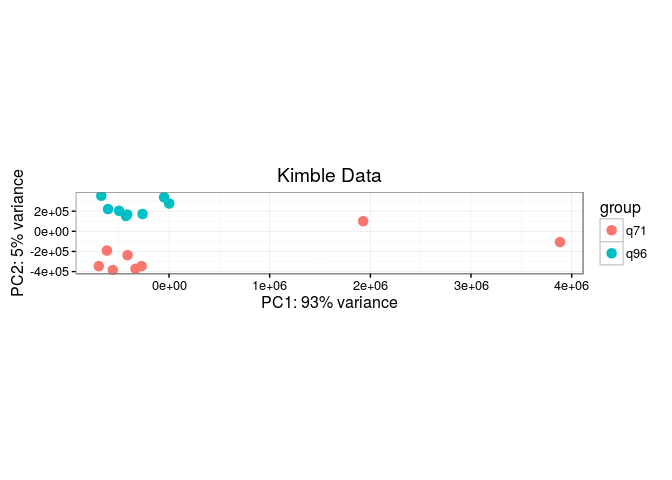

``` r
kimble<-DESeq(kimble)
```

    ## estimating size factors

    ## estimating dispersions

    ## gene-wise dispersion estimates

    ## mean-dispersion relationship

    ## final dispersion estimates

    ## fitting model and testing

    ## -- replacing outliers and refitting for 463 genes
    ## -- DESeq argument 'minReplicatesForReplace' = 7 
    ## -- original counts are preserved in counts(dds)

    ## estimating dispersions

    ## fitting model and testing

``` r
#plotMA(kimble,ylim=c(-14,14))

res_kimble<-results(kimble,lfcThreshold=0,contrast=c("sex","q96","q71"))
res_kimble<-as.data.frame(res_kimble)
res_kimble<-res_kimble[!is.na(res_kimble$padj),]
#res<-res[abs(res$log2FoldChange) > 2,]
#dim(res) #1190
head(res_kimble<-res_kimble[with(res_kimble,order(-log2FoldChange)),])
```

    ##                baseMean log2FoldChange     lfcSE     stat       pvalue
    ## WBGene00019501 321.2708       11.41282 0.7356689 15.51352 2.810295e-54
    ## WBGene00077699 312.4378       11.37716 0.7244667 15.70418 1.415954e-55
    ## WBGene00017172 277.3168       11.20451 0.7307200 15.33352 4.565603e-53
    ## WBGene00008662 450.9630       11.18799 0.7177242 15.58814 8.764417e-55
    ## WBGene00021115 346.4915       11.16705 0.7275609 15.34861 3.618812e-53
    ## WBGene00009704 269.3765       11.16354 0.7301395 15.28959 8.970816e-53
    ##                        padj
    ## WBGene00019501 2.582809e-53
    ## WBGene00077699 1.317800e-54
    ## WBGene00017172 4.139996e-52
    ## WBGene00008662 8.084419e-54
    ## WBGene00021115 3.288221e-52
    ## WBGene00009704 8.113717e-52

``` r
idx<-match(rownames(res_kimble),anno87$ensembl_gene_id)
res_kimble$name<-anno87[idx,"wikigene_name"]
res_kimble$external_name<-anno87[idx,"external_gene_name"]
res_kimble$type<-anno87[idx,"transcript_biotype"]


plot(res_kimble$log2FoldChange,-1*log10(res_kimble$padj),cex=0.5,pch=16)
```

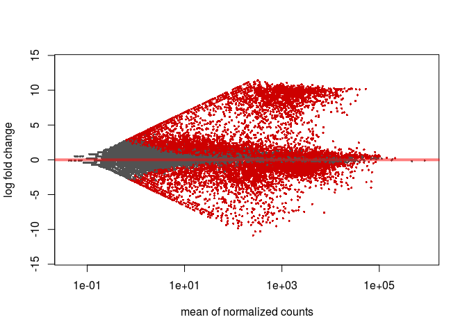

``` r
#Get average make and female fpkms
kimble_fpkm<-as.data.frame(fpkm(kimble))
(oocytes<-which(colData(kimble)[colnames(kimble_fpkm),"sex"]=="q71"))
```

    ## [1] 1 2 3 4 5 6 7 8

``` r
(sperm<-which(colData(kimble)[colnames(kimble_fpkm),"sex"]=="q96"))
```

    ## [1]  9 10 11 12 13 14 15 16

``` r
kimble_fpkm$oocytes<-apply(kimble_fpkm,1,function(x) mean(x[oocytes]))
kimble_fpkm$sperm<-apply(kimble_fpkm,1,function(x) mean(x[sperm]))

#merge with res
idx<-match(rownames(res_kimble),rownames(kimble_fpkm))
res_kimble$oocyte_fpkm<-round(kimble_fpkm[idx,"oocytes"],3)
res_kimble$sperm_fpkm<-round(kimble_fpkm[idx,"sperm"],3)

genes_of_interest<-c("cpb-1","fog-1","fog-3","oma-1","pie-1","him-3","spo-11","C38C6.8","mab-3","spn-4")
res_kimble[res_kimble$name %in% genes_of_interest,]
```

    ##                   baseMean log2FoldChange      lfcSE       stat
    ## WBGene00001483  3130.12451      7.7537901 0.33665553  23.031822
    ## WBGene00003100    51.72019      3.2906149 0.33750878   9.749716
    ## WBGene00001481  3399.50156      2.4699639 0.16701059  14.789265
    ## WBGene00000770  5897.65381      1.6428782 0.22119060   7.427432
    ## WBGene00001862  6265.30342      0.7034515 0.08861342   7.938431
    ## WBGene00004985  2281.97960     -0.3670576 0.10755490  -3.412746
    ## WBGene00003864 10925.01659     -1.2233780 0.20838911  -5.870643
    ## WBGene00004984 22127.29091     -2.5840429 0.18002017 -14.354186
    ## WBGene00004027  2717.89087     -2.9905990 0.15443917 -19.364253
    ##                       pvalue          padj   name external_name
    ## WBGene00001483 2.237816e-117 3.196492e-116  fog-3         fog-3
    ## WBGene00003100  1.849845e-22  1.004274e-21  mab-3         mab-3
    ## WBGene00001481  1.718200e-49  1.498015e-48  fog-1         fog-1
    ## WBGene00000770  1.107259e-13  4.787816e-13  cpb-1         cpb-1
    ## WBGene00001862  2.047548e-15  9.406571e-15  him-3         him-3
    ## WBGene00004985  6.431186e-04  1.506269e-03 spo-11        spo-11
    ## WBGene00003864  4.341092e-09  1.533146e-08  oma-1         oma-1
    ## WBGene00004984  1.002968e-46  8.376257e-46  spn-4         spn-4
    ## WBGene00004027  1.545817e-83  1.818214e-82  pie-1         pie-1
    ##                          type oocyte_fpkm sperm_fpkm
    ## WBGene00001483 protein_coding       0.865    189.287
    ## WBGene00003100 protein_coding       0.169      1.671
    ## WBGene00001481 protein_coding      13.923     77.231
    ## WBGene00000770 protein_coding      40.055    125.239
    ## WBGene00001862 protein_coding     121.473    197.823
    ## WBGene00004985 protein_coding      53.873     41.770
    ## WBGene00003864 protein_coding     254.344    108.846
    ## WBGene00004984 protein_coding     731.093    121.780
    ## WBGene00004027 protein_coding     127.180     15.993

Merge Kimble Data with Master Table and Export
----------------------------------------------

``` r
idx<-match(rownames(res_dds87q4),rownames(res_kimble))
res_dds87q4$gonad.baseMean<-res_kimble[idx,"baseMean"]
res_dds87q4$gonadLog2FoldChange<-res_kimble[idx,"log2FoldChange"]
res_dds87q4$gonadPadj<-res_kimble[idx,"padj"]
res_dds87q4$oocyte_fpkm<-res_kimble[idx,"oocyte_fpkm"]
res_dds87q4$sperm_fpkm<-res_kimble[idx,"sperm_fpkm"]
head(res_dds87q4)
```

    ##                Oma-1 042310   Oma-1 IP  Lin-41 IP  baseMean    Oma1_padj
    ## WBGene00000001   -1.2030370 -0.8394617 -0.1781252 624.09020 1.000000e+00
    ## WBGene00000002   -1.1802662 -1.3342426 -1.4639209  13.03793 1.000000e+00
    ## WBGene00000003    1.8743957  1.1854598  3.4993970 156.92152 2.394217e-05
    ## WBGene00000004    2.2768200  2.1440743  1.3060506 255.25224 2.293937e-25
    ## WBGene00000005    0.3386356  0.2029103 -1.2110551  30.17305 8.160956e-01
    ## WBGene00000006    0.8103127  0.2328430 -0.4117694  25.57514 8.034487e-01
    ##                  Lin41_padj        biotype  name external_name mapq_effect
    ## WBGene00000001 1.000000e+00 protein_coding aap-1         aap-1       FALSE
    ## WBGene00000002 1.000000e+00 protein_coding aat-1         aat-1       FALSE
    ## WBGene00000003 2.825419e-42 protein_coding aat-2         aat-2       FALSE
    ## WBGene00000004 1.601112e-09 protein_coding aat-3         aat-3       FALSE
    ## WBGene00000005 1.000000e+00 protein_coding aat-4         aat-4       FALSE
    ## WBGene00000006 1.000000e+00 protein_coding aat-5         aat-5       FALSE
    ##                oma1_042310_fpkm lysRZ_fpkm oma1_fpkm lin41_fpkm
    ## WBGene00000001            14.49      33.45     18.67      29.56
    ## WBGene00000002             0.34       0.84      0.31       0.27
    ## WBGene00000003             7.60       2.05      4.68      23.58
    ## WBGene00000004            23.07       4.76     21.17      11.81
    ## WBGene00000005             1.78       1.40      1.63       0.57
    ## WBGene00000006             2.14       1.21      1.43       0.89
    ##                gonad.baseMean gonadLog2FoldChange    gonadPadj oocyte_fpkm
    ## WBGene00000001     3263.27005          -0.4950140 2.687254e-07      63.521
    ## WBGene00000002       46.66625           1.0747240 5.310621e-05       0.462
    ## WBGene00000003      206.63641           1.0704434 2.138459e-05       2.294
    ## WBGene00000004      172.81783          -1.8628117 2.975184e-17       4.382
    ## WBGene00000005      126.26070           1.7562412 6.136177e-16       0.980
    ## WBGene00000006       32.09475           0.8775607 1.739795e-03       0.351
    ##                sperm_fpkm
    ## WBGene00000001     45.084
    ## WBGene00000002      0.968
    ## WBGene00000003      4.818
    ## WBGene00000004      1.204
    ## WBGene00000005      3.309
    ## WBGene00000006      0.653

``` r
res_dds87q4[res_dds87q4$name %in% genes_of_interest,]
```

    ##                Oma-1 042310  Oma-1 IP Lin-41 IP    baseMean     Oma1_padj
    ## WBGene00000770    3.3198783 3.1296595  2.763676   2618.8891 8.333602e-104
    ## WBGene00001481    1.3232424 1.0141387  1.396281    523.6631  1.301093e-11
    ## WBGene00001483    1.3883253 1.1831601  2.900234    102.7978  7.940942e-04
    ## WBGene00001862    2.7738091 2.8040000  2.216792   2950.2285 9.568226e-113
    ## WBGene00003100    4.3897139 3.9038099  7.165357    249.3680  4.001369e-30
    ## WBGene00003864    2.8873242 3.0411125  1.655076  10514.5255 1.646391e-145
    ## WBGene00004027    0.8952586 0.8899233  2.595023   2117.1453  3.760122e-15
    ## WBGene00004984    1.2221889 1.1716409  6.214094 180441.0936  8.474651e-39
    ## WBGene00004985    2.5493862 2.3471108  1.054302   1271.0528  3.547726e-70
    ##                   Lin41_padj        biotype   name external_name
    ## WBGene00000770  1.964581e-80 protein_coding  cpb-1         cpb-1
    ## WBGene00001481  6.560830e-21 protein_coding  fog-1         fog-1
    ## WBGene00001483  9.393699e-19 protein_coding  fog-3         fog-3
    ## WBGene00001862  5.423174e-70 protein_coding  him-3         him-3
    ## WBGene00003100 5.574550e-106 protein_coding  mab-3         mab-3
    ## WBGene00003864  1.503371e-43 protein_coding  oma-1         oma-1
    ## WBGene00004027 6.162276e-123 protein_coding  pie-1         pie-1
    ## WBGene00004984  0.000000e+00 protein_coding  spn-4         spn-4
    ## WBGene00004985  2.220899e-14 protein_coding spo-11        spo-11
    ##                mapq_effect oma1_042310_fpkm lysRZ_fpkm oma1_fpkm
    ## WBGene00000770       FALSE           206.68      20.91    184.41
    ## WBGene00001481       FALSE            29.11      11.61     23.52
    ## WBGene00001483       FALSE             8.50       3.27      7.49
    ## WBGene00001862       FALSE           399.71      58.66    411.74
    ## WBGene00003100       FALSE             7.69       0.32      5.07
    ## WBGene00003864       FALSE           988.01     134.61   1113.01
    ## WBGene00004027       FALSE           124.91      67.22    124.75
    ## WBGene00004984       FALSE          1349.03     578.99   1305.56
    ## WBGene00004985       FALSE           163.40      27.95    142.92
    ##                lin41_fpkm gonad.baseMean gonadLog2FoldChange     gonadPadj
    ## WBGene00000770     142.99     5897.65381           1.6428782  4.787816e-13
    ## WBGene00001481      30.68     3399.50156           2.4699639  1.498015e-48
    ## WBGene00001483      25.03     3130.12451           7.7537901 3.196492e-116
    ## WBGene00001862     273.83     6265.30342           0.7034515  9.406571e-15
    ## WBGene00003100      49.16       51.72019           3.2906149  1.004274e-21
    ## WBGene00003864     425.05    10925.01659          -1.2233780  1.533146e-08
    ## WBGene00004027     407.57     2717.89087          -2.9905990  1.818214e-82
    ## WBGene00004984   43194.44    22127.29091          -2.5840429  8.376257e-46
    ## WBGene00004985      58.21     2281.97960          -0.3670576  1.506269e-03
    ##                oocyte_fpkm sperm_fpkm
    ## WBGene00000770      40.055    125.239
    ## WBGene00001481      13.923     77.231
    ## WBGene00001483       0.865    189.287
    ## WBGene00001862     121.473    197.823
    ## WBGene00003100       0.169      1.671
    ## WBGene00003864     254.344    108.846
    ## WBGene00004027     127.180     15.993
    ## WBGene00004984     731.093    121.780
    ## WBGene00004985      53.873     41.770

``` r
write.csv(res_dds87q4[expressed_genes,],file=paste0("enrichment_relative_to_LysateRZ_withGonadEnrichment_",ts,".csv"),quote=F)
options(httr_oob_default=TRUE)

#upload to university google docs
#googlesheets::gs_upload(paste0("enrichment_relative_to_LysateRZ_withGonadEnrichment_",ts,".csv"))
```

Oocyte Expression levels and RNP enrichment
-------------------------------------------

``` r
#plot(log2(res_dds87q4$oma1_fpkm),log2(res_dds87q4$oocyte_fpkm),cex=0.5,pch=16)
#plot(log2(res_dds87q4$oma1_fpkm),res_dds87q4$gonadLog2FoldChange,cex=0.5,pch=16)
#abline(h=0,col="red")

#plot(log2(res_dds87q4$lin41_fpkm),log2(res_dds87q4$oocyte_fpkm),cex=0.5,pch=16)
#plot(log2(res_dds87q4$lin41_fpkm),res_dds87q4$gonadLog2FoldChange,cex=0.5,pch=16)
#abline(h=0,col="red")

g3<-res_dds87q4 %>%  
  mutate(gonadLog2FoldChange=ifelse(is.na(gonadLog2FoldChange),0,gonadLog2FoldChange)) %>% # set NA's to 0 difference
  ggplot(aes(x=log2(lin41_fpkm),y=`Lin-41 IP`)) +
  ggtitle("Lin-41 Enrichment vs Abundance") + xlab("Log2 (Lin-41 FPKM)") + ylab("Log2 Lin-41 Enrichment in IP")+
  xlim(c(-12,20)) + ylim(c(-10,10)) +
  geom_point(size=0.5,aes(colour = gonadLog2FoldChange)) + 
  scale_colour_gradient2(low = "red2", mid = "white", high = "darkblue") +
  theme_bw()

g4<-res_dds87q4 %>%  
  mutate(gonadLog2FoldChange=ifelse(is.na(gonadLog2FoldChange),0,gonadLog2FoldChange)) %>% # set NA's to 0 difference
  ggplot(aes(x=log2(oma1_fpkm),y=`Oma-1 IP`)) +
  xlim(c(-12,20)) + ylim(c(-10,10)) +
  ggtitle("Oma-1 Enrichment vs Abundance") + xlab("Log2 (Oma-1 FPKM)") + ylab("Log2 Oma-1 Enrichment in IP")+
  geom_point(size=0.5,aes(colour = gonadLog2FoldChange)) + 
  scale_colour_gradient2(low = "red2", mid = "white", high = "darkblue") +
  theme_bw()

g3
g4

#svglite("testplot.svg",width=10,height=8)
#grid.arrange(g4,g3,ncol=2)
#dev.off()
```

Make a barplot showing the bias for Oocyte specific genes in the IP'd RNPs. The point here is to determine if the RNPs are loaded in a biased way with transcripts involved in oogenesis. Spike et al originally showed this by seeing how many oogenic genes were in each "bin" of the transcripts present in the IP. But very low abundance transcripts that are oocyte enriched may have large enrichments in the RNPs that would be lost by just binning the IP transcripts by abundance. Probably need to look at it both ways and see if a clear trend is present.

Barplot to show high Abundance Transcripts are more likely to be Oogenic
------------------------------------------------------------------------

``` r
#make the barplot
res_dds87q4 %>% 
  dplyr::select(oma1_fpkm,lin41_fpkm,oocyte_fpkm) %>% 
  mutate(oocyte_fpkm=ifelse(is.na(oocyte_fpkm),0.001,oocyte_fpkm)) %>% 
  gather(gene,fpkm,oma1_fpkm,lin41_fpkm) %>% 
  mutate(high_oocyte = ifelse(oocyte_fpkm > 1,"Oogenic","not Oogenic")) %>% 
  mutate(bin=cut(log2(fpkm+0.001),5,labels=c("e","d","c","b","a"))) %>% 
  mutate(bin=factor(bin,levels=c("a","b","c","d","e"))) %>% 
  group_by(gene,bin) %>% 
  ggplot(aes(x=gene,fill=high_oocyte))+
  geom_bar(stat="count") +facet_grid(.~bin) + theme_bw() +
  xlab("High Abundance  ... Low Abundance") +
  ylab("Number of Transcripts, color by Oocyte Expression Level")  +
  theme(axis.text.x = element_text(angle = 90,  hjust = 0)) 
```

Rethink - these RNPs are clearly going to be loaded with oocyte genes since the expression of the tagged construct is mostly oocyte. It is really just a control to show that the enriched genes (IP vs lysate) are from the oocytes.

``` r
#try a volcano on the kimble data
g5<-res_dds87q4  %>%  
  dplyr::filter(!(is.na(gonadLog2FoldChange) | is.na(gonadPadj))) %>% 
  mutate(oma1_log2FC=ifelse(is.na(`Oma-1 IP`),0,`Oma-1 IP`)) %>% # set NA's to 0 difference
  ggplot(aes(x=gonadLog2FoldChange,y=(-1)*log10(gonadPadj))) +
  ggtitle("Gonad Expression Changes") + xlab("Log2 Gonad Fold Change") + ylab("-log10(gonad p-value)")+
  geom_point(size=1.5,aes(colour = oma1_log2FC)) + 
  scale_colour_gradient2(low = "red2", mid = "white", high = "darkblue") +
  theme_bw() + theme(panel.grid.major=element_blank(), panel.grid.minor=element_blank()) 

g6<-res_dds87q4  %>%  
  dplyr::filter(!(is.na(gonadLog2FoldChange) | is.na(gonadPadj))) %>% 
  mutate(lin41_log2FC=ifelse(is.na(`Oma-1 IP`),0,`Lin-41 IP`)) %>% # set NA's to 0 difference
  ggplot(aes(x=gonadLog2FoldChange,y=(-1)*log10(gonadPadj))) +
  ggtitle("Gonad Expression Changes") + xlab("Log2 Gonad Fold Change") + ylab("-log10(gonad p-value)")+
  geom_point(size=1.5,aes(colour = lin41_log2FC)) + 
  scale_colour_gradient2(low = "red2", mid = "white", high = "darkblue") +
  theme_bw() + theme(panel.grid.major=element_blank(), panel.grid.minor=element_blank()) 

g5
```

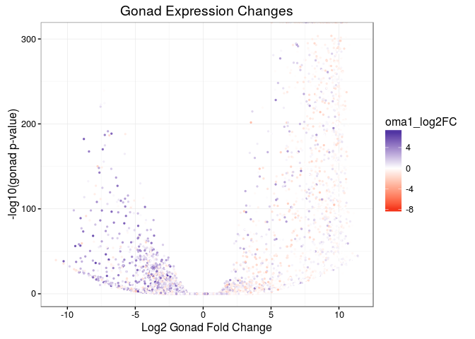

``` r
g6
```

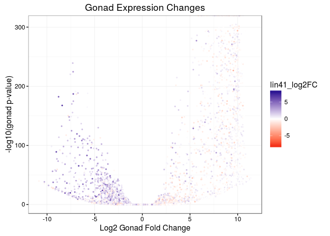

``` r
#grid.arrange(g5,g6,ncol=2)

pdf(paste0("gonad_volcano_oma1_",ts,".pdf"),width=5,height=6); g5; dev.off()
```

    ## png 
    ##   2

``` r
pdf(paste0("gonad_volcano_lin41_",ts,".pdf"),width=5,height=6); g6; dev.off()
```

    ## png 
    ##   2

``` r
ggsave(file=paste0("gonad_volcano_oma1_",ts,".svg"),device = svglite::svglite,plot=g5,width=5,height=6)
ggsave(file=paste0("gonad_volcano_lin41_",ts,".svg"),device = svglite::svglite,plot=g6,width=5,height=6)
```

Session Info
------------

``` r
sessionInfo()
```

    ## R version 3.3.2 (2016-10-31)
    ## Platform: x86_64-pc-linux-gnu (64-bit)
    ## Running under: Debian GNU/Linux 8 (jessie)
    ## 
    ## locale:
    ##  [1] LC_CTYPE=en_US.UTF-8       LC_NUMERIC=C              
    ##  [3] LC_TIME=en_US.UTF-8        LC_COLLATE=en_US.UTF-8    
    ##  [5] LC_MONETARY=en_US.UTF-8    LC_MESSAGES=C             
    ##  [7] LC_PAPER=en_US.UTF-8       LC_NAME=C                 
    ##  [9] LC_ADDRESS=C               LC_TELEPHONE=C            
    ## [11] LC_MEASUREMENT=en_US.UTF-8 LC_IDENTIFICATION=C       
    ## 
    ## attached base packages:
    ##  [1] grid      stats4    parallel  stats     graphics  grDevices utils    
    ##  [8] datasets  methods   base     
    ## 
    ## other attached packages:
    ##  [1] gdtools_0.0.7                     BSgenome.Celegans.UCSC.ce11_1.4.2
    ##  [3] BSgenome_1.40.1                   rtracklayer_1.32.2               
    ##  [5] Gviz_1.19.2                       VennDiagram_1.6.17               
    ##  [7] futile.logger_1.4.1               motifStack_1.16.2                
    ##  [9] ade4_1.7-4                        MotIV_1.28.0                     
    ## [11] grImport_0.9-0                    XML_3.98-1.5                     
    ## [13] gridExtra_2.2.1                   RColorBrewer_1.1-2               
    ## [15] magrittr_1.5                      tidyr_0.5.1                      
    ## [17] dplyr_0.5.0                       svglite_1.1.0                    
    ## [19] ggplot2_2.2.1                     goseq_1.24.0                     
    ## [21] geneLenDataBase_1.8.0             BiasedUrn_1.07                   
    ## [23] SRAdb_1.30.0                      RCurl_1.95-4.8                   
    ## [25] bitops_1.0-6                      graph_1.50.0                     
    ## [27] RSQLite_1.1-2                     dendsort_0.3.3                   
    ## [29] pheatmap_1.0.8                    genefilter_1.54.2                
    ## [31] limma_3.28.14                     DESeq2_1.12.3                    
    ## [33] BiocParallel_1.6.2                GenomicAlignments_1.8.4          
    ## [35] SummarizedExperiment_1.2.3        Rsamtools_1.24.0                 
    ## [37] Biostrings_2.40.2                 XVector_0.12.1                   
    ## [39] GenomicFeatures_1.24.5            AnnotationDbi_1.34.4             
    ## [41] Biobase_2.32.0                    GenomicRanges_1.24.3             
    ## [43] GenomeInfoDb_1.8.7                IRanges_2.6.1                    
    ## [45] S4Vectors_0.10.3                  BiocGenerics_0.18.0              
    ## [47] biomaRt_2.28.0                   
    ## 
    ## loaded via a namespace (and not attached):
    ##  [1] nlme_3.1-128                  matrixStats_0.51.0           
    ##  [3] httr_1.2.1                    rprojroot_1.2                
    ##  [5] tools_3.3.2                   backports_1.0.5              
    ##  [7] R6_2.1.2                      rGADEM_2.20.0                
    ##  [9] KernSmooth_2.23-15            rpart_4.1-10                 
    ## [11] Hmisc_3.17-4                  seqLogo_1.38.0               
    ## [13] DBI_0.6                       lazyeval_0.2.0               
    ## [15] mgcv_1.8-12                   colorspace_1.3-2             
    ## [17] nnet_7.3-12                   chron_2.3-47                 
    ## [19] labeling_0.3                  scales_0.4.1                 
    ## [21] stringr_1.2.0                 digest_0.6.12                
    ## [23] foreign_0.8-67                rmarkdown_1.3                
    ## [25] GEOquery_2.38.4               dichromat_2.0-0              
    ## [27] htmltools_0.3.5               highr_0.6                    
    ## [29] ensembldb_1.4.7               BiocInstaller_1.22.3         
    ## [31] shiny_0.13.2                  acepack_1.3-3.3              
    ## [33] VariantAnnotation_1.18.3      GO.db_3.3.0                  
    ## [35] Formula_1.2-1                 Matrix_1.2-6                 
    ## [37] Rcpp_0.12.10                  munsell_0.4.3                
    ## [39] stringi_1.1.2                 yaml_2.1.13                  
    ## [41] zlibbioc_1.18.0               AnnotationHub_2.4.2          
    ## [43] plyr_1.8.4                    lattice_0.20-34              
    ## [45] splines_3.3.2                 annotate_1.50.0              
    ## [47] locfit_1.5-9.1                knitr_1.15                   
    ## [49] reshape2_1.4.2                geneplotter_1.50.0           
    ## [51] futile.options_1.0.0          evaluate_0.10                
    ## [53] biovizBase_1.20.0             latticeExtra_0.6-28          
    ## [55] lambda.r_1.1.7                data.table_1.9.6             
    ## [57] httpuv_1.3.3                  gtable_0.2.0                 
    ## [59] assertthat_0.1                mime_0.5                     
    ## [61] xtable_1.8-2                  survival_2.39-5              
    ## [63] tibble_1.2                    memoise_1.0.0                
    ## [65] cluster_2.0.4                 interactiveDisplayBase_1.10.3
